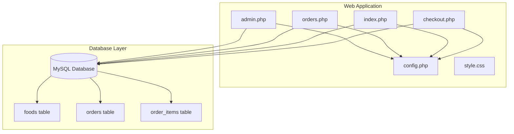
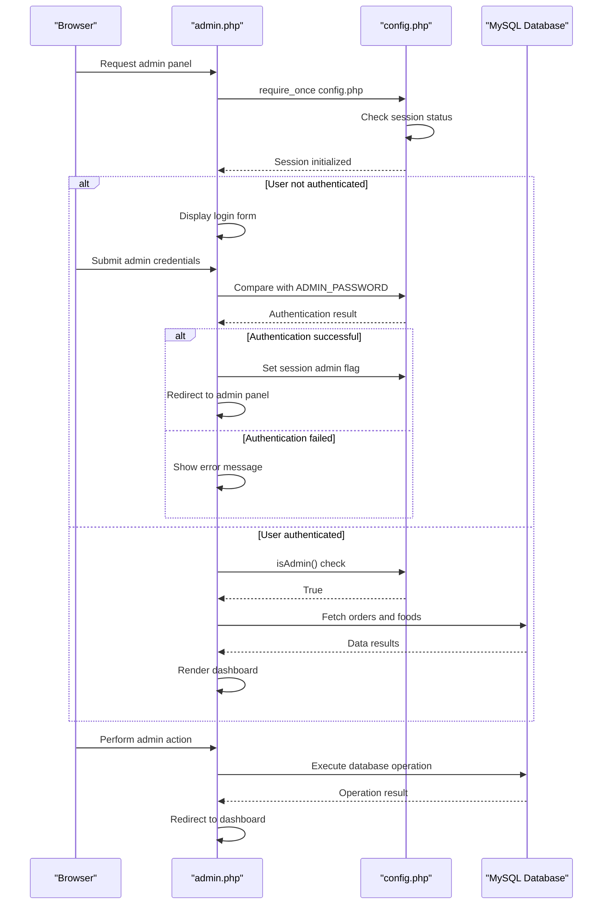
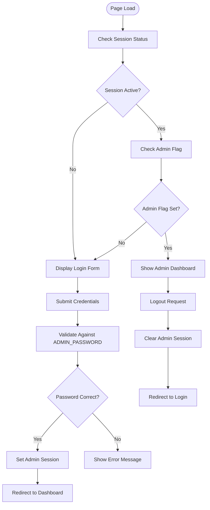
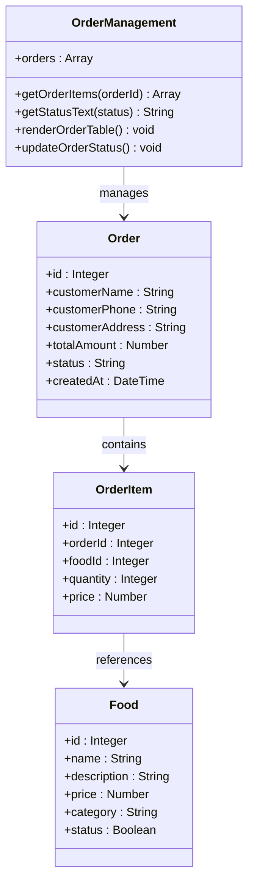
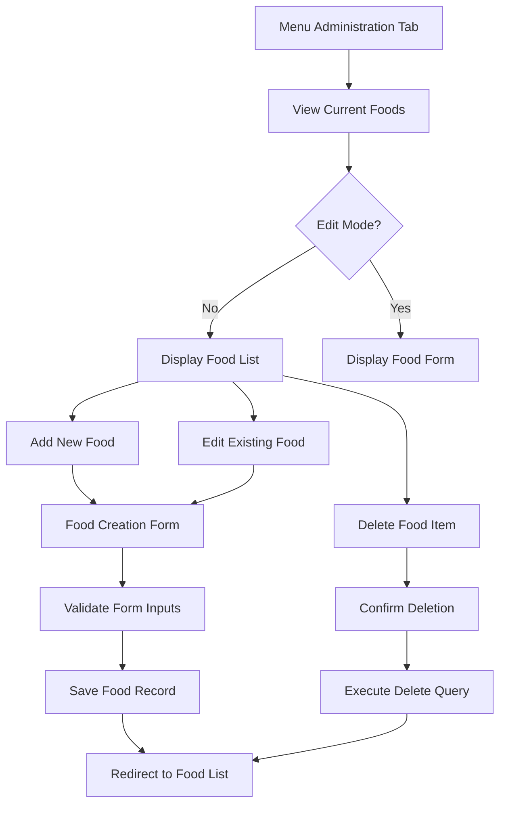
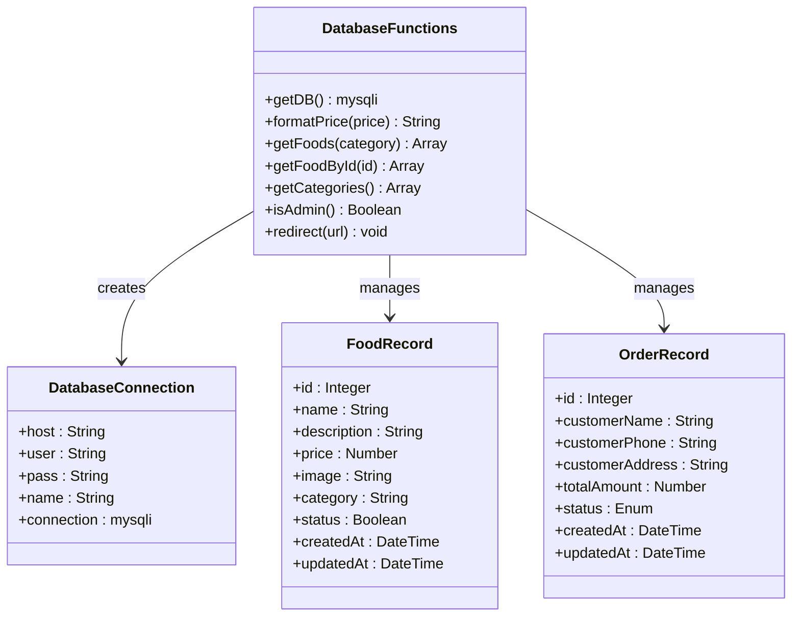
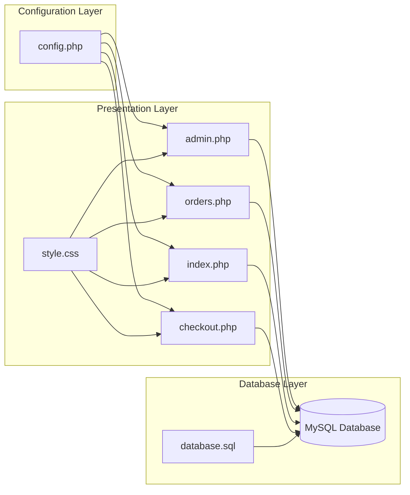

# Administrative Interface

<cite>
**Referenced Files in This Document**
- [admin.php](file://admin.php)
- [config.php](file://config.php)
- [orders.php](file://orders.php)
- [database.sql](file://database.sql)
- [index.php](file://index.php)
- [checkout.php](file://checkout.php)
- [style.css](file://style.css)
</cite>

## Table of Contents
1. [Introduction](#introduction)
2. [Project Structure](#project-structure)
3. [Core Components](#core-components)
4. [Architecture Overview](#architecture-overview)
5. [Detailed Component Analysis](#detailed-component-analysis)
6. [Dependency Analysis](#dependency-analysis)
7. [Performance Considerations](#performance-considerations)
8. [Security Considerations](#security-considerations)
9. [Troubleshooting Guide](#troubleshooting-guide)
10. [Conclusion](#conclusion)

## Introduction
This document provides comprehensive documentation for the administrative interface functionality of the food delivery system. It covers the admin login system using the ADMIN_PASSWORD constant, session-based authentication, protected admin routes, order management dashboard, menu administration features, and integration with centralized database functions. The documentation includes practical guidance for common administrative tasks, workflow optimization, and security enhancements for production deployment.

## Project Structure
The administrative interface consists of several interconnected components that work together to provide a complete management solution:

**Diagram sources**
- [admin.php:1-312](file://admin.php#L1-L312)
- [config.php:1-71](file://config.php#L1-L71)
- [database.sql:1-54](file://database.sql#L1-L54)

**Section sources**
- [admin.php:1-312](file://admin.php#L1-L312)
- [config.php:1-71](file://config.php#L1-L71)
- [database.sql:1-54](file://database.sql#L1-L54)

## Core Components
The administrative interface is built around four primary components that handle different aspects of food delivery management:

### Authentication System
The system implements a simple yet effective authentication mechanism using a predefined admin password stored in the configuration file. The authentication process utilizes PHP sessions to maintain admin state across requests.

### Order Management Dashboard
A comprehensive dashboard that displays all orders with real-time status updates, customer information, and order details. Administrators can modify order statuses directly from this interface.

### Menu Administration
A complete food management system that allows administrators to add, edit, delete, and categorize food items. The system supports multiple categories and maintains food availability status.

### Database Integration
Centralized database functions provide consistent access to the MySQL database with prepared statements for security and performance optimization.

**Section sources**
- [admin.php:4-17](file://admin.php#L4-L17)
- [config.php:56-59](file://config.php#L56-L59)
- [admin.php:62-74](file://admin.php#L62-L74)
- [config.php:27-49](file://config.php#L27-L49)

## Architecture Overview
The administrative interface follows a layered architecture pattern with clear separation of concerns:

**Diagram sources**
- [admin.php:1-312](file://admin.php#L1-L312)
- [config.php:56-71](file://config.php#L56-L71)

The architecture ensures that:
- Authentication logic is centralized in the configuration file
- Database operations are handled through prepared statements
- Session management is consistent across all admin pages
- Data presentation is separated from business logic

**Section sources**
- [admin.php:1-312](file://admin.php#L1-L312)
- [config.php:1-71](file://config.php#L1-L71)

## Detailed Component Analysis

### Admin Login System
The login system implements a straightforward authentication mechanism using a constant password defined in the configuration file. The system uses PHP sessions to maintain admin state and provides secure redirection after successful authentication.

**Diagram sources**
- [admin.php:4-17](file://admin.php#L4-L17)
- [config.php:56-59](file://config.php#L56-L59)

Key security considerations:
- The ADMIN_PASSWORD constant should be changed immediately after installation
- Consider implementing rate limiting to prevent brute force attacks
- Add CSRF protection for form submissions
- Implement session timeout mechanisms

**Section sources**
- [admin.php:4-17](file://admin.php#L4-L17)
- [config.php:56-59](file://config.php#L56-L59)

### Order Management Dashboard
The order management dashboard provides comprehensive visibility into all customer orders with real-time status updates and efficient modification capabilities.

**Diagram sources**
- [admin.php:62-96](file://admin.php#L62-L96)
- [orders.php:18-36](file://orders.php#L18-L36)

The dashboard features:
- Real-time order listing with pagination support
- Comprehensive order details including customer information
- Inline status modification with dropdown controls
- Category-based filtering for food items
- Responsive design for mobile device compatibility

**Section sources**
- [admin.php:147-206](file://admin.php#L147-L206)
- [orders.php:60-133](file://orders.php#L60-L133)

### Menu Administration Features
The menu administration system provides complete CRUD (Create, Read, Update, Delete) operations for food items along with category management and inventory control.

**Diagram sources**
- [admin.php:216-304](file://admin.php#L216-L304)

The food management system includes:
- Complete CRUD operations for food items
- Category-based organization with predefined categories
- Price management with currency formatting
- Status control for food availability
- Image upload capability for food items

**Section sources**
- [admin.php:32-60](file://admin.php#L32-L60)
- [admin.php:216-304](file://admin.php#L216-L304)
- [config.php:51-54](file://config.php#L51-L54)

### Database Integration and Functions
The centralized database functions provide consistent access to the MySQL database with security and performance optimizations.

**Diagram sources**
- [config.php:9-25](file://config.php#L9-L25)
- [config.php:27-49](file://config.php#L27-L49)

Key database features:
- Singleton pattern for database connections
- Prepared statements for all SQL operations
- UTF-8 character set support
- Centralized price formatting functions
- Category management system

**Section sources**
- [config.php:9-25](file://config.php#L9-L25)
- [config.php:27-49](file://config.php#L27-L49)
- [database.sql:6-40](file://database.sql#L6-L40)

## Dependency Analysis
The administrative interface has well-defined dependencies that ensure maintainable and scalable code:

**Diagram sources**
- [admin.php:1-2](file://admin.php#L1-L2)
- [config.php:1-71](file://config.php#L1-L71)
- [database.sql:1-54](file://database.sql#L1-L54)

The dependency structure provides:
- Single point of configuration management
- Consistent database access patterns
- Shared styling across all pages
- Clear separation between business logic and presentation

**Section sources**
- [admin.php:1-2](file://admin.php#L1-L2)
- [config.php:1-71](file://config.php#L1-L71)
- [database.sql:1-54](file://database.sql#L1-L54)

## Performance Considerations
The administrative interface is designed with several performance optimizations:

### Database Optimization
- Prepared statements reduce query parsing overhead
- Singleton database connection prevents multiple connections
- Efficient JOIN queries for order details
- Proper indexing on frequently queried columns

### Caching Strategies
- Static database connection reduces connection overhead
- Session-based authentication avoids repeated credential checks
- Local storage for cart management reduces server load

### Frontend Optimization
- Minimal JavaScript for improved loading performance
- CSS-inlined styles reduce HTTP requests
- Responsive design reduces device-specific development costs

## Security Considerations
The administrative interface implements several security measures, though production deployment requires additional enhancements:

### Current Security Measures
- Session-based authentication with admin flag verification
- Prepared statements prevent SQL injection attacks
- Basic input validation and sanitization
- Redirect-based navigation prevents direct access

### Recommended Security Enhancements
- **Password Security**: Replace ADMIN_PASSWORD constant with hashed passwords using bcrypt
- **Rate Limiting**: Implement login attempt limits to prevent brute force attacks
- **CSRF Protection**: Add anti-CSRF tokens to all forms
- **Session Security**: Implement session regeneration and timeout mechanisms
- **Input Validation**: Add comprehensive server-side validation
- **HTTPS Enforcement**: Force HTTPS for all admin pages
- **Audit Logging**: Track admin actions for security monitoring

### Access Control Best Practices
- Role-based permissions for different admin levels
- IP whitelisting for admin access
- Two-factor authentication for admin accounts
- Regular security audits and vulnerability assessments

**Section sources**
- [admin.php:4-17](file://admin.php#L4-L17)
- [config.php:56-59](file://config.php#L56-L59)

## Troubleshooting Guide
Common issues and their solutions:

### Authentication Issues
- **Problem**: Cannot log into admin panel
  - **Solution**: Verify ADMIN_PASSWORD constant matches submitted password
  - **Check**: Ensure session_start() executes before session access
  - **Debug**: Check browser cookies and session file permissions

### Database Connection Problems
- **Problem**: Database connection fails
  - **Solution**: Verify database credentials in config.php
  - **Check**: Ensure MySQL service is running
  - **Debug**: Test connection with standalone script

### Order Management Issues
- **Problem**: Orders not displaying correctly
  - **Solution**: Verify database tables exist and contain data
  - **Check**: Ensure proper JOIN conditions in queries
  - **Debug**: Test individual query execution

### Menu Administration Problems
- **Problem**: Food items not saving correctly
  - **Solution**: Verify form field names match database columns
  - **Check**: Ensure proper validation of numeric fields
  - **Debug**: Test individual INSERT/UPDATE operations

**Section sources**
- [admin.php:4-17](file://admin.php#L4-L17)
- [config.php:9-20](file://config.php#L9-L20)
- [database.sql:1-54](file://database.sql#L1-L54)

## Conclusion
The administrative interface provides a comprehensive solution for managing a food delivery service with intuitive order management, flexible menu administration, and secure authentication. The modular architecture ensures maintainability while the centralized database functions provide consistent data access patterns.

For production deployment, the system requires additional security enhancements including password hashing, rate limiting, CSRF protection, and session security improvements. The responsive design and efficient database operations ensure good performance across different devices and usage scenarios.

The clear separation of concerns and well-defined dependencies make the system suitable for extension and customization based on specific business requirements.