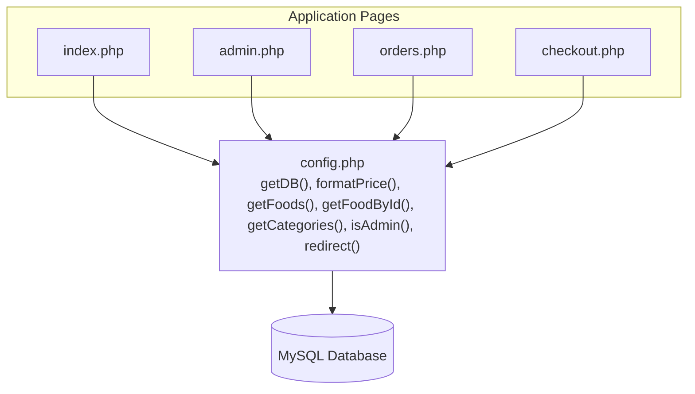
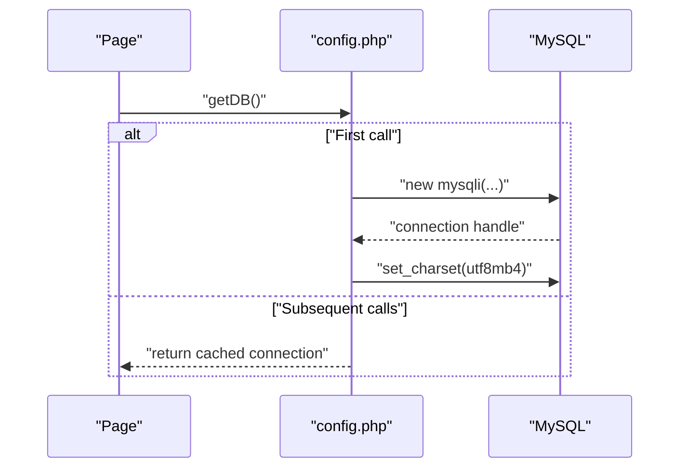
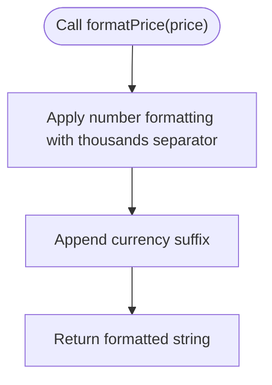
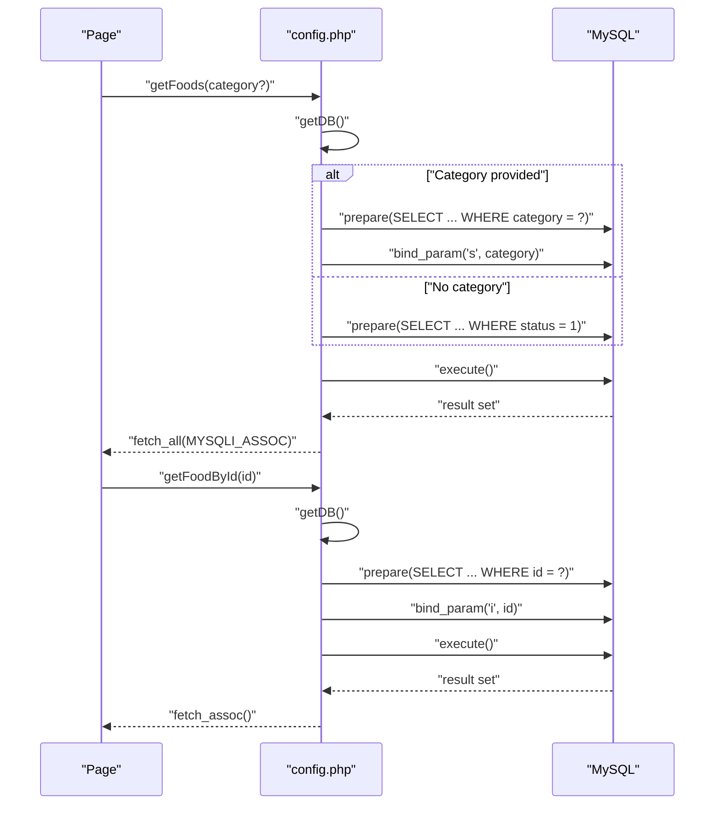
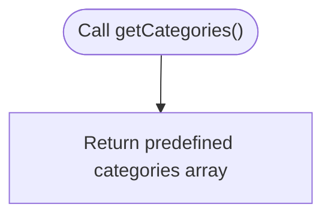
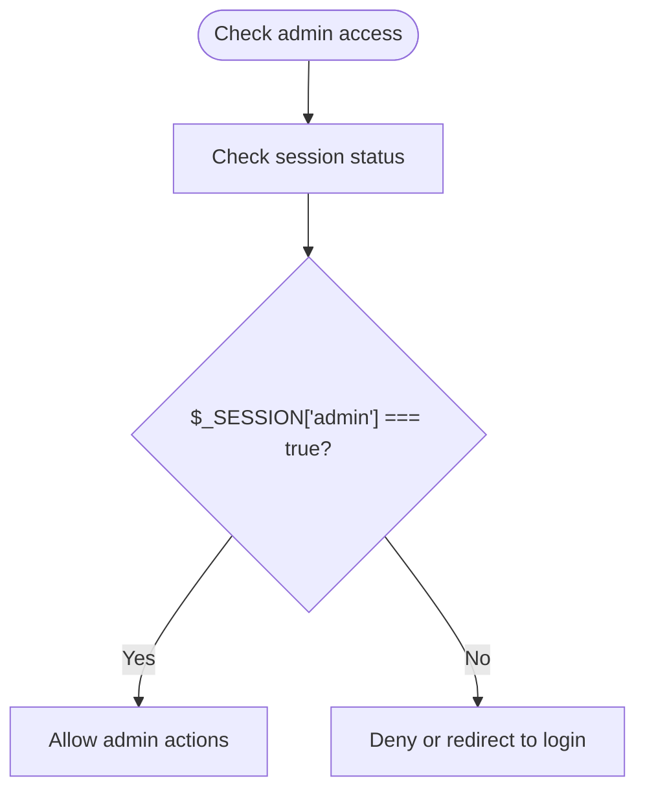
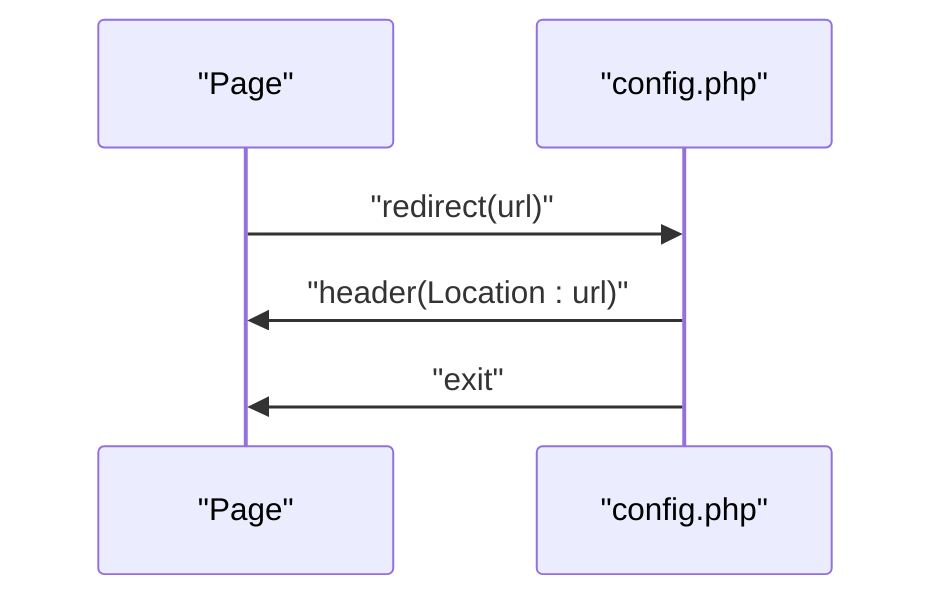
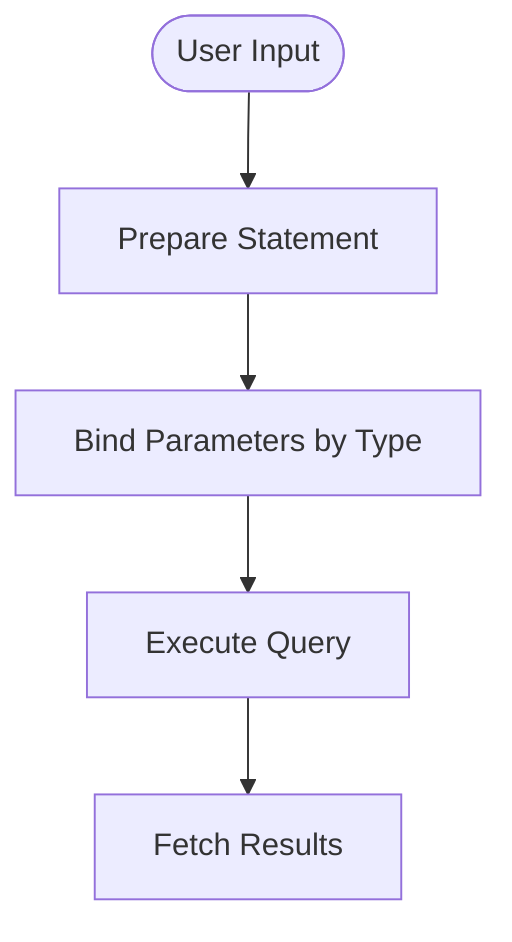
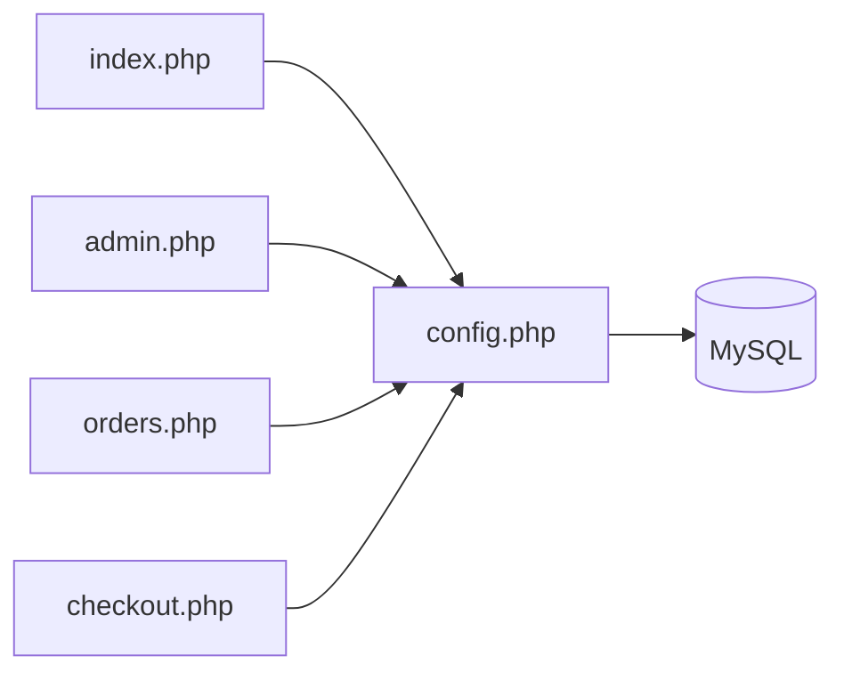

# Core Components

<cite>
**Referenced Files in This Document**
- [config.php](file://config.php)
- [index.php](file://index.php)
- [admin.php](file://admin.php)
- [orders.php](file://orders.php)
- [checkout.php](file://checkout.php)
- [database.sql](file://database.sql)
</cite>

## Table of Contents
1. [Introduction](#introduction)
2. [Project Structure](#project-structure)
3. [Core Components](#core-components)
4. [Architecture Overview](#architecture-overview)
5. [Detailed Component Analysis](#detailed-component-analysis)
6. [Dependency Analysis](#dependency-analysis)
7. [Performance Considerations](#performance-considerations)
8. [Troubleshooting Guide](#troubleshooting-guide)
9. [Conclusion](#conclusion)

## Introduction
This document focuses on the centralized configuration and utility layer of the food delivery application, centered around the config.php file. It explains the database connection singleton pattern, utility functions for price formatting and food retrieval, session management and authentication helpers, and the redirect function. It also covers the ADMIN_PASSWORD constant usage, the getDB() singleton behavior, how prepared statements ensure security, concrete examples of function usage across the application, parameter handling in getFoods() and getFoodById(), and the role of getCategories() in menu organization. Security considerations, performance implications of the singleton pattern, and best practices for extending the configuration system are addressed.

## Project Structure
The application follows a minimal PHP architecture with a central configuration file that exposes shared utilities and database connectivity. Pages include the homepage, admin panel, order search, and checkout flow. All pages require the configuration file to access database functions, formatting utilities, and session helpers.

```mermaid
graph TB
Config["config.php<br/>Constants, DB singleton, utils, sessions"] --> Index["index.php<br/>Menu listing, categories, cart"]
Config --> Admin["admin.php<br/>Admin login, orders, foods CRUD"]
Config --> Orders["orders.php<br/>Order search by phone"]
Config --> Checkout["checkout.php<br/>Place order, persist cart"]
DB[("MySQL Database<br/>foods, orders, order_items")] <- --> Config
```

**Diagram sources**
- [config.php:1-71](file://config.php#L1-L71)
- [index.php:1-203](file://index.php#L1-L203)
- [admin.php:1-312](file://admin.php#L1-L312)
- [orders.php:1-137](file://orders.php#L1-L137)
- [checkout.php:1-127](file://checkout.php#L1-L127)

**Section sources**
- [config.php:1-71](file://config.php#L1-L71)
- [index.php:1-203](file://index.php#L1-L203)
- [admin.php:1-312](file://admin.php#L1-L312)
- [orders.php:1-137](file://orders.php#L1-L137)
- [checkout.php:1-127](file://checkout.php#L1-L127)

## Core Components
This section documents the core configuration and utility functions implemented in config.php, and how they are used across the application.

- Database configuration constants
  - Host, user, password, and database name are defined as constants for centralized configuration.
  - These constants are consumed by the database connection function to establish connections.

- ADMIN_PASSWORD constant
  - Used for admin login verification in the admin panel. It is compared against the submitted password during login.

- getDB() singleton
  - Implements a static connection instance to ensure a single database connection per request lifecycle.
  - Sets the character set for the connection.
  - On connection failure, terminates execution with an error message.

- Utility functions
  - formatPrice(): Formats numeric prices with thousands separators and currency suffix.
  - getFoods(category): Retrieves foods with optional category filtering using prepared statements.
  - getFoodById(id): Retrieves a single food by ID using a prepared statement.
  - getCategories(): Returns the predefined list of categories used for menu organization.

- Session management and authentication helpers
  - isAdmin(): Checks whether the current session indicates admin privileges.
  - Session initialization: Starts a session if one is not already active.

- Redirect function
  - redirect(url): Sends an HTTP redirect header and exits immediately.

- Prepared statements and security
  - All database operations that accept user input use prepared statements with explicit parameter binding to prevent SQL injection.

- Example usage across the application
  - index.php: Uses getFoods(), getCategories(), formatPrice(), and session navigation.
  - admin.php: Uses getDB(), getFoods(), getCategories(), redirect(), and admin login/logout.
  - orders.php: Uses getDB(), getOrderItems(), getStatusText(), and formatPrice().
  - checkout.php: Uses getDB(), prepares and executes order creation and order items insertion.

**Section sources**
- [config.php:1-71](file://config.php#L1-L71)
- [index.php:1-203](file://index.php#L1-L203)
- [admin.php:1-312](file://admin.php#L1-L312)
- [orders.php:1-137](file://orders.php#L1-L137)
- [checkout.php:1-127](file://checkout.php#L1-L127)

## Architecture Overview
The configuration layer acts as a shared service provider for the entire application. It encapsulates database connectivity, formatting, and session management while exposing simple functions that pages consume. Prepared statements ensure secure interactions with the database.



**Diagram sources**
- [config.php:1-71](file://config.php#L1-L71)
- [index.php:1-203](file://index.php#L1-L203)
- [admin.php:1-312](file://admin.php#L1-L312)
- [orders.php:1-137](file://orders.php#L1-L137)
- [checkout.php:1-127](file://checkout.php#L1-L127)

## Detailed Component Analysis

### Database Connection Singleton Pattern (getDB)
- Purpose: Provide a single persistent database connection per request to reduce overhead and ensure consistent charset settings.
- Behavior:
  - Maintains a static connection instance.
  - Creates the connection only if it does not exist.
  - Sets the connection character set.
  - Terminates execution on connection failure.
- Usage:
  - Called implicitly by all database utility functions and directly by pages that need raw queries.



**Diagram sources**
- [config.php:10-20](file://config.php#L10-L20)

**Section sources**
- [config.php:10-20](file://config.php#L10-L20)

### Price Formatting (formatPrice)
- Purpose: Format numeric prices with thousands separators and a currency suffix.
- Usage:
  - Applied in index.php, orders.php, and checkout.php to present prices consistently.



**Diagram sources**
- [config.php:23-25](file://config.php#L23-L25)

**Section sources**
- [config.php:23-25](file://config.php#L23-L25)
- [index.php:62](file://index.php#L62)
- [orders.php:114](file://orders.php#L114)
- [checkout.php:117](file://checkout.php#L117)

### Food Retrieval Functions (getFoods, getFoodById)
- getFoods(category):
  - Retrieves all active foods (status = 1).
  - If a category is provided, filters by category using a prepared statement.
  - Returns an associative array of results.
- getFoodById(id):
  - Retrieves a single food by its ID using a prepared statement.
  - Returns a single associative row.



**Diagram sources**
- [config.php:28-49](file://config.php#L28-L49)

**Section sources**
- [config.php:28-49](file://config.php#L28-L49)
- [index.php:4-6](file://index.php#L4-L6)
- [admin.php:216-226](file://admin.php#L216-L226)

### Categories Organization (getCategories)
- Purpose: Provide the predefined list of categories used for menu filtering and admin forms.
- Role:
  - Enables category-based filtering in index.php.
  - Supplies category options in admin.php food form.



**Diagram sources**
- [config.php:51-54](file://config.php#L51-L54)

**Section sources**
- [config.php:51-54](file://config.php#L51-L54)
- [index.php:34-49](file://index.php#L34-L49)
- [admin.php:250-260](file://admin.php#L250-L260)

### Session Management and Authentication Helpers (isAdmin, Session Init)
- isAdmin():
  - Checks if the admin session flag is set and equals true.
- Session Initialization:
  - Ensures a session is started if one is not already active.
- Usage:
  - Enforced in admin.php for protected actions (order updates, food CRUD).
  - Controls visibility of admin links and forms.



**Diagram sources**
- [config.php:57-70](file://config.php#L57-L70)
- [admin.php:23-30](file://admin.php#L23-L30)
- [admin.php:111-116](file://admin.php#L111-L116)

**Section sources**
- [config.php:57-70](file://config.php#L57-L70)
- [admin.php:1-17](file://admin.php#L1-L17)
- [admin.php:23-30](file://admin.php#L23-L30)

### Redirect Helper (redirect)
- Purpose: Perform HTTP redirection and terminate script execution.
- Usage:
  - Used in admin.php for post-login and post-action redirects.



**Diagram sources**
- [config.php:62-65](file://config.php#L62-L65)
- [admin.php:16](file://admin.php#L16)

**Section sources**
- [config.php:62-65](file://config.php#L62-L65)
- [admin.php:16](file://admin.php#L16)

### Prepared Statements and Security
- All dynamic queries bind parameters explicitly:
  - getFoods(category) binds category as string.
  - getFoodById(id) binds id as integer.
  - orders.php search binds a LIKE pattern as string.
  - admin.php updates and deletions bind parameters for safety.
  - checkout.php inserts orders and order items with typed bindings.
- Benefits:
  - Prevents SQL injection by separating SQL logic from user data.
  - Improves performance through statement preparation reuse.



**Diagram sources**
- [config.php:33-37](file://config.php#L33-L37)
- [config.php:45-48](file://config.php#L45-L48)
- [orders.php:11-15](file://orders.php#L11-L15)
- [admin.php:26-29](file://admin.php#L26-L29)
- [admin.php:42-48](file://admin.php#L42-L48)
- [admin.php:56-59](file://admin.php#L56-L59)
- [checkout.php:22-32](file://checkout.php#L22-L32)

**Section sources**
- [config.php:28-49](file://config.php#L28-L49)
- [orders.php:11-25](file://orders.php#L11-L25)
- [admin.php:23-60](file://admin.php#L23-L60)
- [checkout.php:4-36](file://checkout.php#L4-L36)

### Concrete Examples of Function Usage
- index.php
  - Retrieves category filter from query string and passes it to getFoods().
  - Uses getCategories() to render category buttons.
  - Applies formatPrice() to display food prices.
- admin.php
  - Uses getDB() for order and food queries.
  - Uses getCategories() in the food form.
  - Uses redirect() after admin actions.
  - Uses isAdmin() to protect admin features.
- orders.php
  - Uses getDB() and prepared statements to search orders by phone.
  - Defines local helper functions getOrderItems() and getStatusText().
  - Uses formatPrice() for totals and itemized costs.
- checkout.php
  - Uses getDB() to insert orders and order items.
  - Calculates total amount from the cart and persists it.

**Section sources**
- [index.php:4-6](file://index.php#L4-L6)
- [index.php:34-49](file://index.php#L34-L49)
- [index.php:62](file://index.php#L62)
- [admin.php:19-74](file://admin.php#L19-L74)
- [admin.php:96](file://admin.php#L96)
- [orders.php:10-25](file://orders.php#L10-L25)
- [orders.php:18-36](file://orders.php#L18-L36)
- [orders.php:114](file://orders.php#L114)
- [checkout.php:13-36](file://checkout.php#L13-L36)

## Dependency Analysis
The configuration file is a central dependency for all pages. Pages depend on config.php for:
- Database connectivity (getDB)
- Formatting (formatPrice)
- Food retrieval (getFoods, getFoodById)
- Categories (getCategories)
- Session and admin checks (isAdmin)
- Redirects (redirect)



**Diagram sources**
- [config.php:1-71](file://config.php#L1-L71)
- [index.php:1-2](file://index.php#L1-L2)
- [admin.php:1-2](file://admin.php#L1-L2)
- [orders.php:1-2](file://orders.php#L1-L2)
- [checkout.php:1-2](file://checkout.php#L1-L2)

**Section sources**
- [config.php:1-71](file://config.php#L1-L71)
- [index.php:1-2](file://index.php#L1-L2)
- [admin.php:1-2](file://admin.php#L1-L2)
- [orders.php:1-2](file://orders.php#L1-L2)
- [checkout.php:1-2](file://checkout.php#L1-L2)

## Performance Considerations
- Singleton pattern benefits:
  - Reduces repeated connection overhead per request.
  - Ensures consistent character set configuration.
- Potential drawbacks:
  - Single connection per request may limit concurrent operations if the application grows.
  - Consider pooling or connection reuse strategies for high-load scenarios.
- Prepared statements:
  - Improve performance by reusing compiled query plans.
  - Reduce CPU overhead from parsing and planning queries repeatedly.
- Caching:
  - Consider caching frequently accessed data (e.g., categories) if the dataset remains static.
- Character set:
  - Using utf8mb4 ensures broader Unicode support and avoids conversion costs later.

[No sources needed since this section provides general guidance]

## Troubleshooting Guide
- Database connection failures:
  - Symptoms: Immediate termination with a connection error message.
  - Resolution: Verify host, user, password, and database name constants; ensure MySQL server is running and credentials are correct.
- Admin login issues:
  - Symptoms: Incorrect password errors or inability to access admin features.
  - Resolution: Confirm ADMIN_PASSWORD constant value and session initialization.
- Redirect loops:
  - Symptoms: Unexpected page reloads after admin actions.
  - Resolution: Ensure redirect() is called after database updates and that headers are sent before any output.
- Parameter binding errors:
  - Symptoms: SQL errors or unexpected query results.
  - Resolution: Verify parameter types match placeholders and that all user inputs are bound before execution.
- Category filtering not working:
  - Symptoms: All foods shown regardless of selected category.
  - Resolution: Confirm category parameter is passed correctly and matches predefined categories.

**Section sources**
- [config.php:14-16](file://config.php#L14-L16)
- [config.php:62-65](file://config.php#L62-L65)
- [admin.php:6-11](file://admin.php#L6-L11)
- [config.php:33-37](file://config.php#L33-L37)
- [config.php:45-48](file://config.php#L45-L48)
- [index.php:4](file://index.php#L4)

## Conclusion
The config.php file serves as the central configuration and utility hub for the food delivery application. Its singleton database connection, robust prepared statement usage, and consistent formatting utilities enable clean, secure, and maintainable page implementations. By adhering to the established patterns—using getDB(), binding parameters, and leveraging helper functions—developers can extend the system reliably while preserving security and performance.