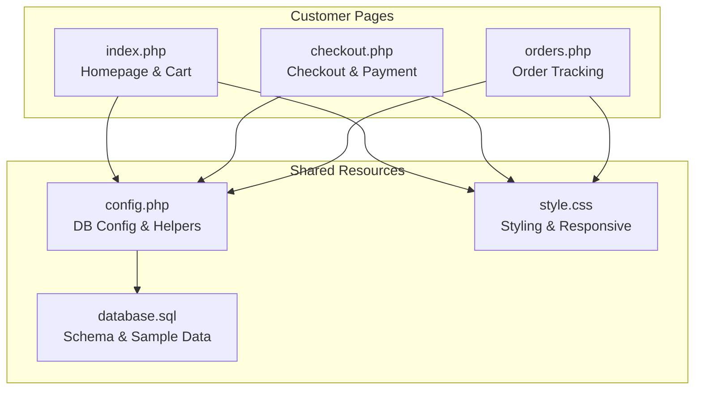
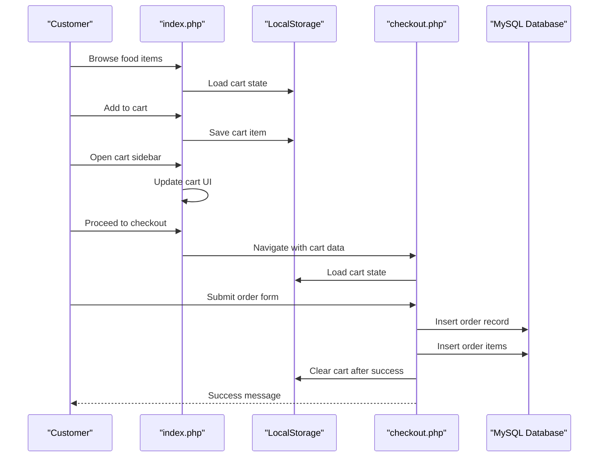
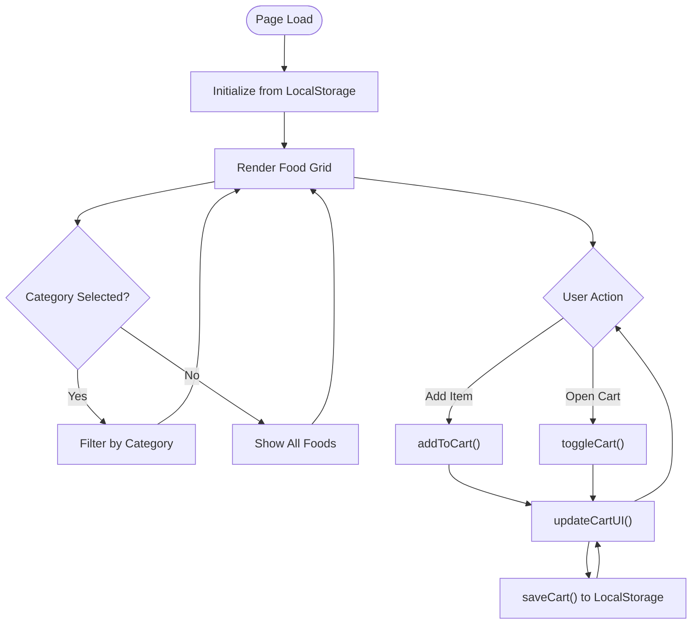
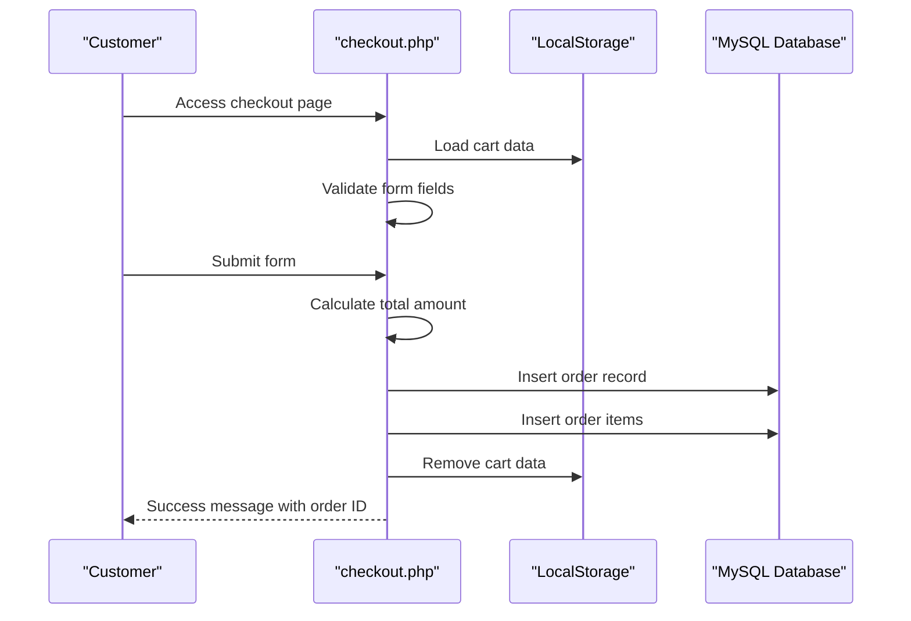
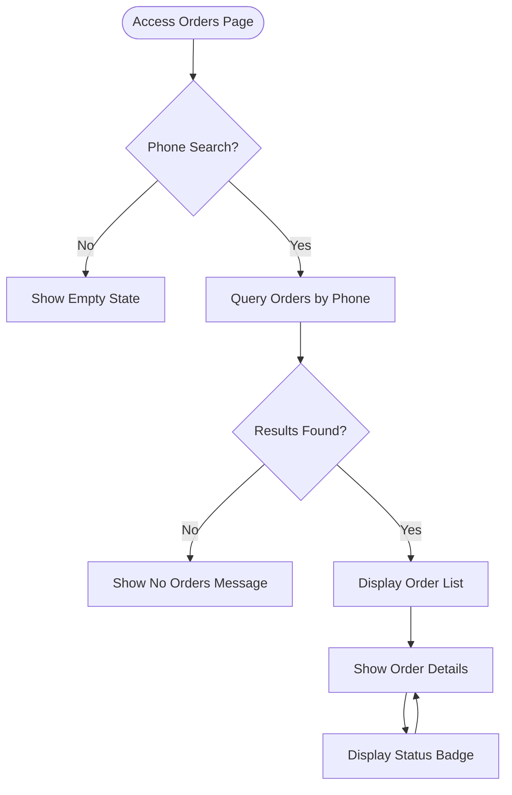
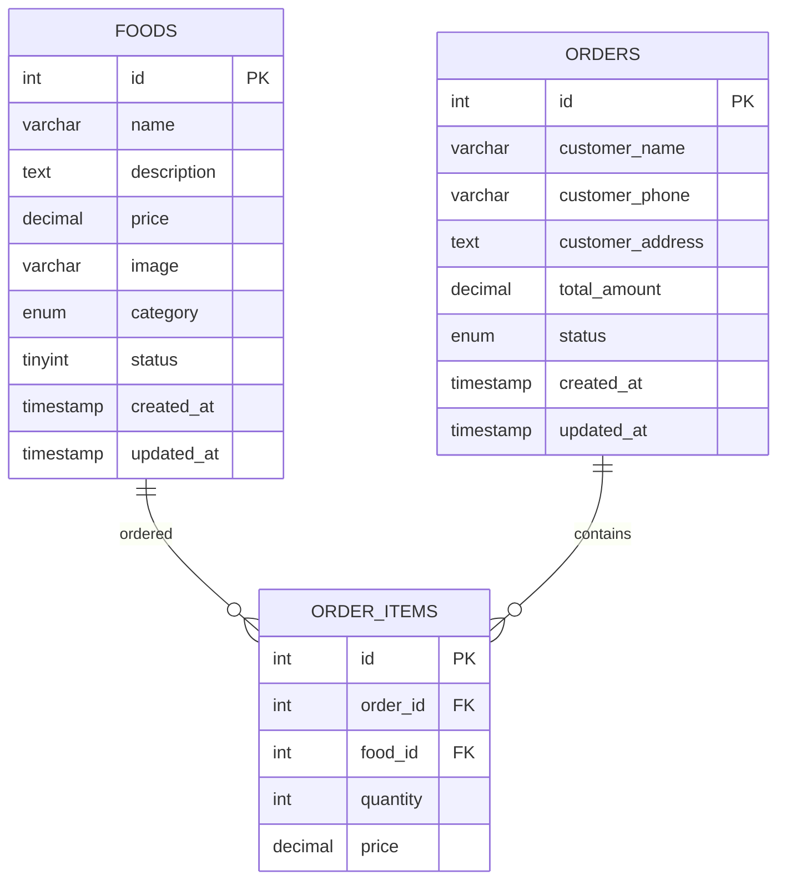
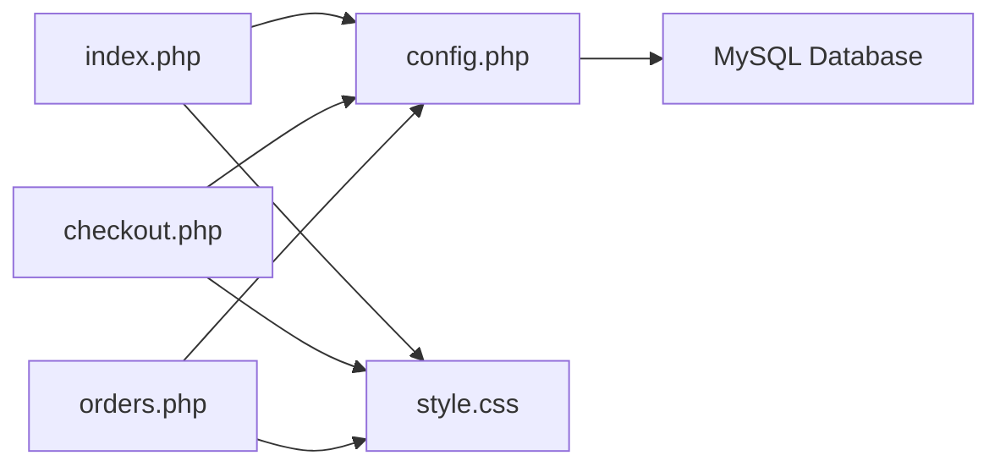

# Customer Interface

<cite>
**Referenced Files in This Document**
- [index.php](file://index.php)
- [checkout.php](file://checkout.php)
- [orders.php](file://orders.php)
- [config.php](file://config.php)
- [style.css](file://style.css)
- [database.sql](file://database.sql)
</cite>

## Table of Contents
1. [Introduction](#introduction)
2. [Project Structure](#project-structure)
3. [Core Components](#core-components)
4. [Architecture Overview](#architecture-overview)
5. [Detailed Component Analysis](#detailed-component-analysis)
6. [Dependency Analysis](#dependency-analysis)
7. [Performance Considerations](#performance-considerations)
8. [Troubleshooting Guide](#troubleshooting-guide)
9. [Conclusion](#conclusion)
10. [Appendices](#appendices)

## Introduction
This document provides comprehensive documentation for the customer-facing interface components of a food delivery system. It covers the homepage functionality for browsing food items, category filtering, and shopping cart management with LocalStorage persistence. It explains the checkout process for collecting customer information, validating forms, placing orders, and handling database transactions. It details the order tracking interface for displaying order history, monitoring status, and showing timelines. Additionally, it documents the CSS styling system, responsive design implementation, and user interaction patterns. Practical examples of customer workflows are included, along with explanations of the integration between frontend JavaScript and backend PHP, and the LocalStorage API usage for cart persistence across browser sessions.

## Project Structure
The project consists of four primary customer-facing pages and shared configuration and styling resources:
- index.php: Homepage with food browsing, category filtering, and cart sidebar
- checkout.php: Customer information collection, form validation, order placement, and transaction handling
- orders.php: Order history display, status monitoring, and timeline functionality
- config.php: Database connection, utility functions, and shared helpers
- style.css: Centralized CSS for styling, responsive design, and interactive elements
- database.sql: Database schema definition and sample data

**Diagram sources**
- [index.php:1-203](file://index.php#L1-L203)
- [checkout.php:1-127](file://checkout.php#L1-L127)
- [orders.php:1-137](file://orders.php#L1-L137)
- [config.php:1-71](file://config.php#L1-L71)
- [style.css:1-610](file://style.css#L1-L610)
- [database.sql:1-54](file://database.sql#L1-L54)

**Section sources**
- [index.php:1-203](file://index.php#L1-L203)
- [checkout.php:1-127](file://checkout.php#L1-L127)
- [orders.php:1-137](file://orders.php#L1-L137)
- [config.php:1-71](file://config.php#L1-L71)
- [style.css:1-610](file://style.css#L1-L610)
- [database.sql:1-54](file://database.sql#L1-L54)

## Core Components
This section outlines the primary customer-facing components and their responsibilities:
- Homepage (index.php): Displays food items, category filtering, and cart management with LocalStorage persistence
- Checkout (checkout.php): Collects customer information, validates inputs, places orders, and handles database transactions
- Order Tracking (orders.php): Shows order history, displays order details, and monitors status
- Shared Configuration (config.php): Provides database connectivity, formatting utilities, and helper functions
- Styling (style.css): Implements responsive design, animations, and interactive UI components
- Database Schema (database.sql): Defines tables for foods, orders, and order items with foreign key relationships

Key capabilities:
- Food browsing with category filtering and dynamic updates
- Shopping cart with add/remove/update quantity and LocalStorage persistence
- Checkout form with validation and order creation
- Order history with search by phone and status display
- Responsive design for mobile and desktop experiences

**Section sources**
- [index.php:1-203](file://index.php#L1-L203)
- [checkout.php:1-127](file://checkout.php#L1-L127)
- [orders.php:1-137](file://orders.php#L1-L137)
- [config.php:1-71](file://config.php#L1-L71)
- [style.css:1-610](file://style.css#L1-L610)
- [database.sql:1-54](file://database.sql#L1-L54)

## Architecture Overview
The customer interface follows a client-server model with PHP backend and HTML/CSS/JavaScript frontend:
- Frontend: index.php and checkout.php handle user interactions, cart management, and form submissions
- Backend: config.php manages database connections and provides helper functions
- Data Persistence: LocalStorage for cart state and MySQL for order history and inventory
- Styling: Centralized CSS with responsive breakpoints and interactive states

**Diagram sources**
- [index.php:101-200](file://index.php#L101-L200)
- [checkout.php:107-124](file://checkout.php#L107-L124)
- [config.php:9-25](file://config.php#L9-L25)

**Section sources**
- [index.php:101-200](file://index.php#L101-L200)
- [checkout.php:107-124](file://checkout.php#L107-L124)
- [config.php:9-25](file://config.php#L9-L25)

## Detailed Component Analysis

### Homepage (index.php)
The homepage serves as the primary food browsing interface with integrated cart management:
- Category filtering: Dynamic buttons for food categories with active state highlighting
- Food grid: Responsive grid layout with hover effects and pricing display
- Cart sidebar: Slide-out panel with item management and quantity controls
- LocalStorage integration: Persistent cart state across browser sessions

Key features:
- Category navigation: Clicking category buttons filters food items dynamically
- Add to cart: Button triggers addToCart function with item details
- Cart management: Quantity adjustment, removal, and real-time total calculation
- Responsive design: Mobile-friendly cart sidebar with overlay

**Diagram sources**
- [index.php:101-200](file://index.php#L101-L200)

**Section sources**
- [index.php:1-203](file://index.php#L1-L203)

### Checkout Process (checkout.php)
The checkout page handles customer information collection, form validation, and order placement:
- Form fields: Name, phone, address with required validation
- Cart integration: Loads cart from LocalStorage and calculates totals
- Database transactions: Inserts order and order items with prepared statements
- Success handling: Clears cart and displays order confirmation

**Diagram sources**
- [checkout.php:4-36](file://checkout.php#L4-L36)
- [checkout.php:107-124](file://checkout.php#L107-L124)

**Section sources**
- [checkout.php:1-127](file://checkout.php#L1-L127)

### Order Tracking (orders.php)
The order tracking interface enables customers to monitor their order history:
- Phone-based search: Filters orders by customer phone number
- Status display: Shows order status with color-coded badges
- Order details: Lists items, quantities, prices, and totals
- Timeline: Displays creation timestamps for order progression

**Diagram sources**
- [orders.php:6-36](file://orders.php#L6-L36)

**Section sources**
- [orders.php:1-137](file://orders.php#L1-L137)

### CSS Styling System
The styling system provides a cohesive design with responsive behavior:
- Base styles: Reset, container sizing, and typography
- Header navigation: Gradient branding with cart counter
- Category filtering: Interactive buttons with hover and active states
- Food grid: Responsive cards with hover animations
- Cart sidebar: Slide-out panel with overlay and item controls
- Forms: Validation states and focus effects
- Status badges: Color-coded indicators for order states
- Responsive breakpoints: Mobile-first design with media queries

Key design patterns:
- Consistent color scheme using red/orange accents
- Card-based layout with shadows and rounded corners
- Smooth transitions for interactive elements
- Mobile-optimized cart sidebar with overlay
- Status-based color coding for quick recognition

**Section sources**
- [style.css:1-610](file://style.css#L1-L610)

### Database Integration
The system integrates with a MySQL database through PHP:
- Connection management: Singleton pattern with persistent connection
- Prepared statements: Prevents SQL injection and ensures data integrity
- Helper functions: Food retrieval, category listing, and formatting utilities
- Transaction handling: Atomic order creation with order items

**Diagram sources**
- [database.sql:6-40](file://database.sql#L6-L40)
- [config.php:27-54](file://config.php#L27-L54)

**Section sources**
- [database.sql:1-54](file://database.sql#L1-L54)
- [config.php:1-71](file://config.php#L1-L71)

## Dependency Analysis
The customer interface components have the following dependencies:
- index.php depends on config.php for database functions and style.css for presentation
- checkout.php depends on config.php for database operations and style.css for styling
- orders.php depends on config.php for database queries and style.css for UI
- config.php manages database connections and provides shared utilities
- style.css is used by all pages for consistent styling

**Diagram sources**
- [index.php:1-7](file://index.php#L1-L7)
- [checkout.php:1-3](file://checkout.php#L1-L3)
- [orders.php:1-3](file://orders.php#L1-L3)
- [config.php:1-20](file://config.php#L1-L20)

**Section sources**
- [index.php:1-7](file://index.php#L1-L7)
- [checkout.php:1-3](file://checkout.php#L1-L3)
- [orders.php:1-3](file://orders.php#L1-L3)
- [config.php:1-20](file://config.php#L1-L20)

## Performance Considerations
- LocalStorage optimization: Cart data is serialized and stored locally to reduce server requests
- Database queries: Prepared statements minimize query overhead and prevent injection
- Responsive design: CSS media queries optimize rendering for different screen sizes
- Image handling: Emoji placeholders reduce asset loading overhead
- Session management: Efficient session handling prevents unnecessary overhead

Best practices:
- Minimize DOM manipulations in cart updates
- Debounce frequent UI updates
- Use efficient CSS selectors
- Optimize database queries with appropriate indexing

## Troubleshooting Guide
Common issues and solutions:
- Cart not persisting: Verify LocalStorage availability and browser permissions
- Empty cart on checkout: Ensure cart data is properly serialized before submission
- Database connection errors: Check credentials in config.php and database availability
- Styling inconsistencies: Verify CSS file loading and browser cache clearing
- Order placement failures: Review database schema and constraint violations

Debugging steps:
- Check browser console for JavaScript errors
- Verify network requests in developer tools
- Test database connectivity independently
- Validate form field requirements
- Confirm session state for admin features

**Section sources**
- [index.php:101-200](file://index.php#L101-L200)
- [checkout.php:107-124](file://checkout.php#L107-L124)
- [config.php:9-25](file://config.php#L9-L25)

## Conclusion
The customer interface provides a comprehensive food delivery experience with intuitive browsing, seamless cart management, and robust order tracking. The integration of LocalStorage ensures persistent cart state, while the PHP backend handles secure database operations. The responsive design delivers consistent experiences across devices, and the modular architecture supports easy maintenance and extension. The system demonstrates effective separation of concerns between frontend interactivity and backend data management.

## Appendices

### Customer Workflows
Typical customer journeys:
- Browse and purchase: View foods → Filter by category → Add items → Manage cart → Proceed to checkout → Complete order
- Track order: Enter phone number → View order history → Monitor status → Receive updates
- Admin access: Navigate to admin page → Authenticate → Manage inventory and orders

### API and Data Flow
- Food browsing: GET request to index.php with optional category parameter
- Cart operations: LocalStorage API for persistence, JavaScript functions for manipulation
- Checkout submission: POST request with form data and serialized cart
- Order tracking: GET request to orders.php with phone search parameter

### Browser Compatibility
- Modern browsers with JavaScript and LocalStorage support
- Responsive design works on mobile, tablet, and desktop devices
- CSS3 features with graceful degradation for older browsers