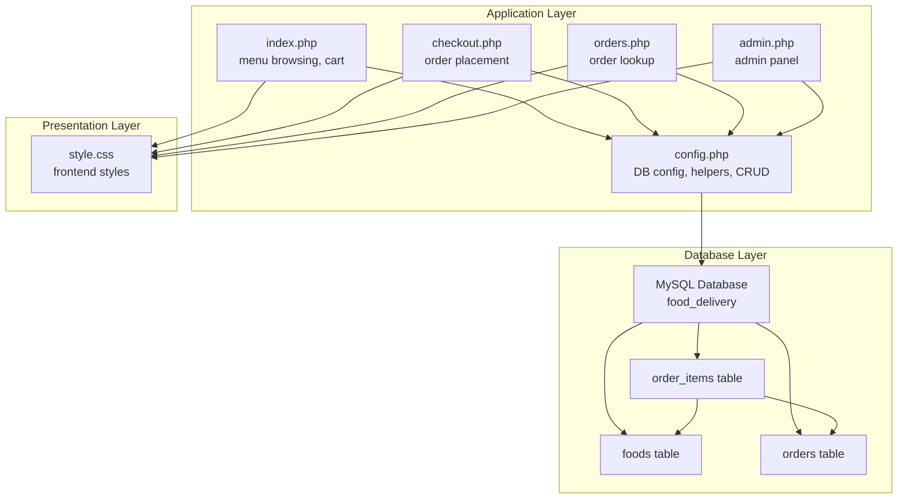
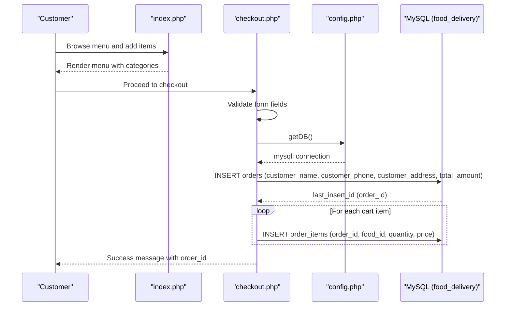
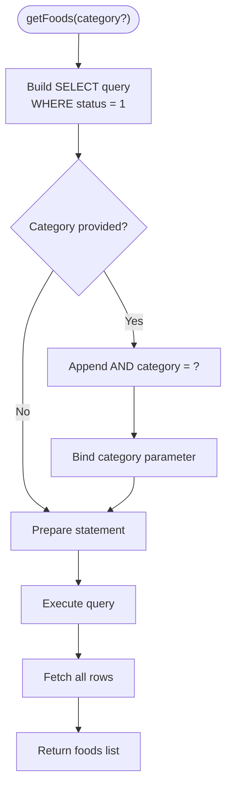
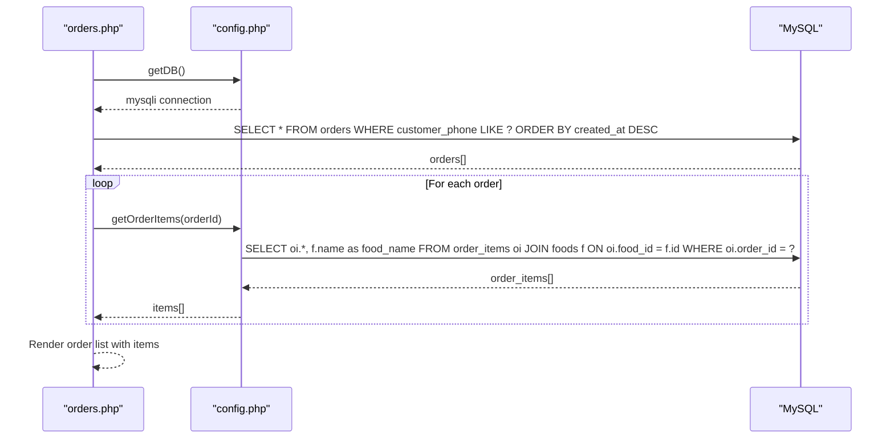
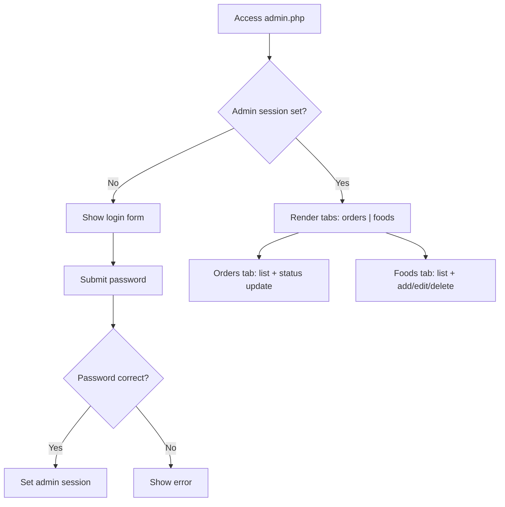
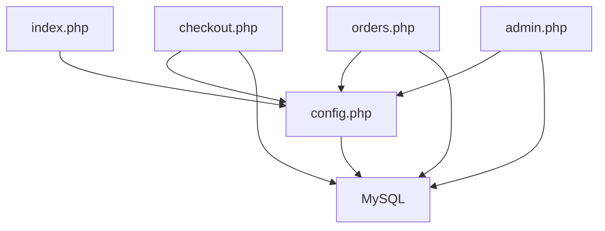
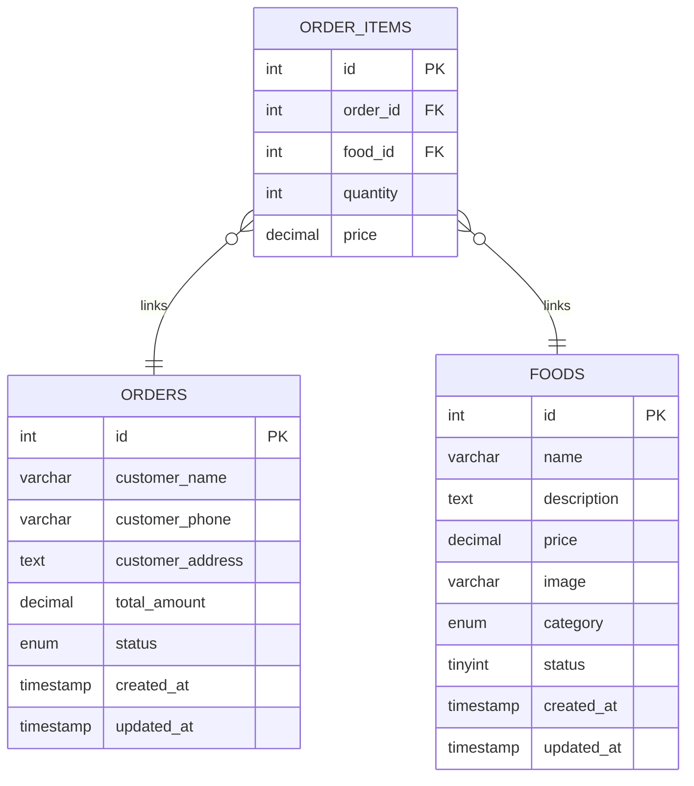

# Database Design

<cite>
**Referenced Files in This Document**
- [database.sql](file://database.sql)
- [config.php](file://config.php)
- [index.php](file://index.php)
- [checkout.php](file://checkout.php)
- [orders.php](file://orders.php)
- [admin.php](file://admin.php)
- [style.css](file://style.css)
</cite>

## Table of Contents
1. [Introduction](#introduction)
2. [Project Structure](#project-structure)
3. [Core Components](#core-components)
4. [Architecture Overview](#architecture-overview)
5. [Detailed Component Analysis](#detailed-component-analysis)
6. [Dependency Analysis](#dependency-analysis)
7. [Performance Considerations](#performance-considerations)
8. [Troubleshooting Guide](#troubleshooting-guide)
9. [Conclusion](#conclusion)
10. [Appendices](#appendices)

## Introduction
This document provides comprehensive data model documentation for the Food Delivery System. It details the three-table relational design, including the foods table, orders table, and order_items junction table. The document explains primary keys, foreign key relationships, indexes, constraints, normalized design choices, data type selections, and business rules enforcement. It also demonstrates category management via the getCategories() function, explains the status field usage for order tracking, and addresses data validation rules, performance considerations, and potential extensions.

## Project Structure
The project follows a straightforward MVC-like separation:
- Database schema definition and seed data are in a dedicated SQL script.
- Application logic is implemented in PHP scripts that handle routing, data access, and presentation.
- Frontend styling is handled via a single CSS file.



**Diagram sources**
- [database.sql:1-54](file://database.sql#L1-L54)
- [config.php:1-71](file://config.php#L1-L71)
- [index.php:1-203](file://index.php#L1-L203)
- [checkout.php:1-127](file://checkout.php#L1-L127)
- [orders.php:1-137](file://orders.php#L1-L137)
- [admin.php:1-312](file://admin.php#L1-L312)
- [style.css:1-610](file://style.css#L1-L610)

**Section sources**
- [database.sql:1-54](file://database.sql#L1-L54)
- [config.php:1-71](file://config.php#L1-L71)
- [index.php:1-203](file://index.php#L1-L203)
- [checkout.php:1-127](file://checkout.php#L1-L127)
- [orders.php:1-137](file://orders.php#L1-L137)
- [admin.php:1-312](file://admin.php#L1-L312)
- [style.css:1-610](file://style.css#L1-L610)

## Core Components
This section documents the three-table relational design and associated business rules.

- foods table
  - Purpose: Stores menu items with metadata and availability.
  - Primary key: id (auto-increment integer).
  - Columns and constraints:
    - id: INT AUTO_INCREMENT PRIMARY KEY
    - name: VARCHAR(255) NOT NULL
    - description: TEXT
    - price: DECIMAL(10, 2) NOT NULL
    - image: VARCHAR(255)
    - category: ENUM('Lavash', 'Burger', 'Pizza', 'Ichimliklar', 'Osh') NOT NULL
    - status: TINYINT DEFAULT 1 (used for soft-deletion/availability)
    - created_at: TIMESTAMP DEFAULT CURRENT_TIMESTAMP
    - updated_at: TIMESTAMP DEFAULT CURRENT_TIMESTAMP ON UPDATE CURRENT_TIMESTAMP
  - Notes:
    - The category ENUM restricts valid categories.
    - status = 1 indicates active/in-stock; consumers filter by status = 1 in queries.
    - Timestamps support audit trails.

- orders table
  - Purpose: Captures customer orders with current status.
  - Primary key: id (auto-increment integer).
  - Columns and constraints:
    - id: INT AUTO_INCREMENT PRIMARY KEY
    - customer_name: VARCHAR(255) NOT NULL
    - customer_phone: VARCHAR(20) NOT NULL
    - customer_address: TEXT
    - total_amount: DECIMAL(10, 2) NOT NULL
    - status: ENUM('pending', 'preparing', 'ready', 'delivered') DEFAULT 'pending'
    - created_at: TIMESTAMP DEFAULT CURRENT_TIMESTAMP
    - updated_at: TIMESTAMP DEFAULT CURRENT_TIMESTAMP ON UPDATE CURRENT_TIMESTAMP
  - Notes:
    - Status tracks order lifecycle.
    - total_amount reflects computed cart value at order creation.

- order_items junction table
  - Purpose: Links orders to foods with quantities and prices at order time.
  - Primary key: id (auto-increment integer).
  - Foreign keys:
    - order_id -> orders.id (ON DELETE CASCADE)
    - food_id -> foods.id
  - Columns and constraints:
    - id: INT AUTO_INCREMENT PRIMARY KEY
    - order_id: INT NOT NULL
    - food_id: INT NOT NULL
    - quantity: INT NOT NULL
    - price: DECIMAL(10, 2) NOT NULL
  - Notes:
    - price is stored per item to preserve pricing at order time.
    - CASCADE deletion ensures child records are removed when an order is deleted.

Sample data insertion is included in the schema script, populating the foods table with representative menu items.

**Section sources**
- [database.sql:6-40](file://database.sql#L6-L40)
- [database.sql:42-53](file://database.sql#L42-L53)

## Architecture Overview
The system architecture connects frontend pages to the database through PHP functions and prepared statements. The flow below illustrates how the checkout process persists an order and its items.



**Diagram sources**
- [checkout.php:4-36](file://checkout.php#L4-L36)
- [config.php:9-20](file://config.php#L9-L20)
- [database.sql:19-29](file://database.sql#L19-L29)
- [database.sql:31-40](file://database.sql#L31-L40)

## Detailed Component Analysis

### Foods Management
- Category filtering:
  - The getFoods() function retrieves only active foods (status = 1) and optionally filters by category.
  - Category enumeration is managed centrally via getCategories().
- Availability:
  - status = 1 controls visibility in the menu; inactive items are excluded from listings.
- Data types:
  - DECIMAL(10, 2) ensures precise currency storage.
  - ENUM constraints enforce valid categories and statuses.



**Diagram sources**
- [config.php:27-40](file://config.php#L27-L40)
- [config.php:51-54](file://config.php#L51-L54)

**Section sources**
- [config.php:27-40](file://config.php#L27-L40)
- [config.php:51-54](file://config.php#L51-L54)
- [index.php:4-6](file://index.php#L4-L6)

### Orders and Order Items
- Order creation:
  - checkout.php computes total from the client-side cart and inserts a record into orders.
  - It then inserts each cart item into order_items with the current item price.
- Order lookup:
  - orders.php allows searching orders by customer phone and displays order items joined with food names.
- Status tracking:
  - admin.php updates order status through a dropdown; the orders page translates internal ENUM values to readable labels.



**Diagram sources**
- [orders.php:6-25](file://orders.php#L6-L25)
- [config.php:9-20](file://config.php#L9-L20)
- [database.sql:31-40](file://database.sql#L31-L40)

**Section sources**
- [checkout.php:4-36](file://checkout.php#L4-L36)
- [orders.php:6-25](file://orders.php#L6-L25)
- [admin.php:22-30](file://admin.php#L22-L30)

### Admin Panel
- Authentication:
  - admin.php checks a predefined password against a constant to grant admin access.
- Order management:
  - Displays orders with status badges and allows updating status via a form post.
- Food management:
  - Provides CRUD operations for foods, including adding, editing, and deleting entries.
  - Uses getCategories() to populate category dropdowns.



**Diagram sources**
- [admin.php:4-17](file://admin.php#L4-L17)
- [admin.php:22-30](file://admin.php#L22-L30)
- [admin.php:32-60](file://admin.php#L32-L60)
- [config.php:51-54](file://config.php#L51-L54)

**Section sources**
- [admin.php:4-17](file://admin.php#L4-L17)
- [admin.php:22-30](file://admin.php#L22-L30)
- [admin.php:32-60](file://admin.php#L32-L60)
- [config.php:51-54](file://config.php#L51-L54)

### Frontend Integration
- Menu browsing:
  - index.php fetches foods filtered by category and renders cards with add-to-cart actions.
- Cart persistence:
  - JavaScript stores cart in localStorage and calculates totals locally before submission.
- Styling:
  - style.css defines responsive layouts, cart sidebar, and status badges.

```mermaid
graph LR
IDX["index.php"] --> |getFoods()| CFG["config.php"]
IDX --> |localStorage cart| IDX
CHK["checkout.php"] --> |POST cart JSON| CHK
ORD["orders.php"] --> |getOrderItems()| CFG
ADM["admin.php"] --> |getCategories()| CFG
```

**Diagram sources**
- [index.php:4-6](file://index.php#L4-L6)
- [checkout.php:8-36](file://checkout.php#L8-L36)
- [orders.php:18-25](file://orders.php#L18-L25)
- [admin.php:96](file://admin.php#L96)
- [config.php:27-40](file://config.php#L27-L40)

**Section sources**
- [index.php:4-6](file://index.php#L4-L6)
- [checkout.php:8-36](file://checkout.php#L8-L36)
- [orders.php:18-25](file://orders.php#L18-L25)
- [admin.php:96](file://admin.php#L96)
- [config.php:27-40](file://config.php#L27-L40)

## Dependency Analysis
- Data access layer:
  - All pages depend on config.php for database connectivity and helper functions.
- Business logic:
  - checkout.php depends on getDB() and performs order aggregation and persistence.
  - orders.php and admin.php depend on getOrderItems() and getCategories() for rendering.
- Referential integrity:
  - order_items.order_id references orders.id with ON DELETE CASCADE.
  - order_items.food_id references foods.id.



**Diagram sources**
- [config.php:9-20](file://config.php#L9-L20)
- [checkout.php:4-36](file://checkout.php#L4-L36)
- [orders.php:6-25](file://orders.php#L6-L25)
- [admin.php:62-74](file://admin.php#L62-L74)
- [database.sql:38-39](file://database.sql#L38-L39)

**Section sources**
- [config.php:9-20](file://config.php#L9-L20)
- [checkout.php:4-36](file://checkout.php#L4-L36)
- [orders.php:6-25](file://orders.php#L6-L25)
- [admin.php:62-74](file://admin.php#L62-L74)
- [database.sql:38-39](file://database.sql#L38-L39)

## Performance Considerations
- Indexes:
  - Primary keys are implicitly indexed by MySQL.
  - Consider adding explicit indexes for frequently queried columns:
    - foods.category for category filtering.
    - orders.customer_phone for order lookup by phone.
    - order_items.order_id for retrieving order details efficiently.
- Prepared statements:
  - All data access uses prepared statements, reducing SQL injection risk and enabling query plan reuse.
- Data types:
  - DECIMAL(10, 2) ensures precise monetary calculations without floating-point errors.
- Caching:
  - Consider caching category lists and popular menu items to reduce repeated queries.
- Pagination:
  - For large datasets, implement pagination in admin views and order history.

## Troubleshooting Guide
- Connection failures:
  - getDB() throws an error if mysqli connection fails; verify host, user, password, and database name in config.php.
- Missing or invalid data:
  - checkout.php validates required fields; ensure name, phone, and cart are present before submission.
- Order not appearing:
  - Confirm orders are ordered by created_at DESC and that customer_phone LIKE search matches partial numbers.
- Status not updating:
  - Ensure admin session is active and the form posts update_status with correct order_id and status values.
- Category mismatch:
  - getCategories() returns a fixed list; ensure submitted category values match the ENUM list.

**Section sources**
- [config.php:9-20](file://config.php#L9-L20)
- [checkout.php:10-12](file://checkout.php#L10-L12)
- [orders.php:10-16](file://orders.php#L10-L16)
- [admin.php:22-30](file://admin.php#L22-L30)
- [config.php:51-54](file://config.php#L51-L54)

## Conclusion
The Food Delivery System employs a clean, normalized relational design with explicit constraints and business rules. The foods, orders, and order_items tables capture menu inventory, customer orders, and order-line details respectively. Prepared statements and ENUM constraints ensure data integrity, while the status field enables robust order tracking. The frontend integrates seamlessly with backend logic, and the admin panel provides essential operational capabilities. With targeted indexing and caching strategies, the system can scale effectively.

## Appendices

### Data Model Diagram


**Diagram sources**
- [database.sql:6-17](file://database.sql#L6-L17)
- [database.sql:19-29](file://database.sql#L19-L29)
- [database.sql:31-40](file://database.sql#L31-L40)

### Sample Data
- Foods inserted during schema initialization include various menu items across categories such as Lavash, Burger, Pizza, Ichimliklar, and Osh.

**Section sources**
- [database.sql:42-53](file://database.sql#L42-L53)