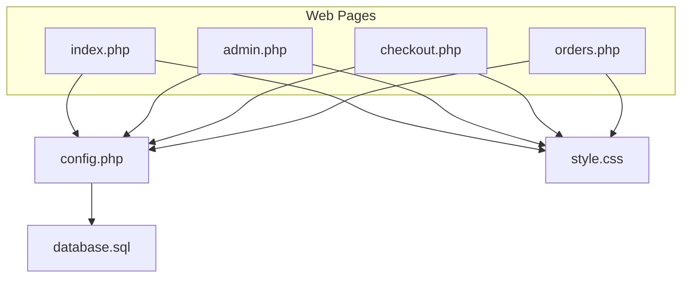
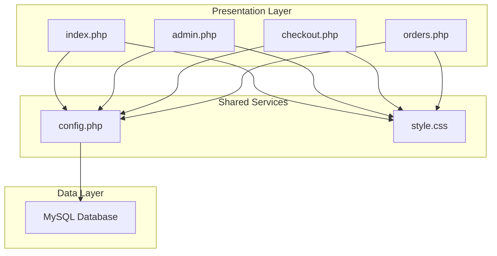
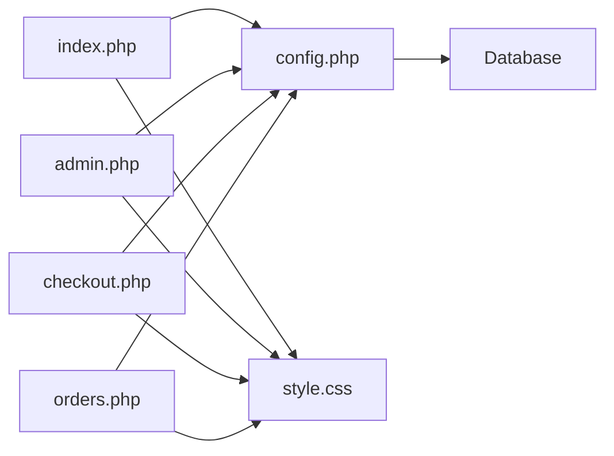

# Development Guidelines

<cite>
**Referenced Files in This Document**
- [index.php](file://index.php)
- [admin.php](file://admin.php)
- [checkout.php](file://checkout.php)
- [orders.php](file://orders.php)
- [config.php](file://config.php)
- [style.css](file://style.css)
- [database.sql](file://database.sql)
</cite>

## Table of Contents
1. [Introduction](#introduction)
2. [Project Structure](#project-structure)
3. [Core Components](#core-components)
4. [Architecture Overview](#architecture-overview)
5. [Detailed Component Analysis](#detailed-component-analysis)
6. [Dependency Analysis](#dependency-analysis)
7. [Performance Considerations](#performance-considerations)
8. [Troubleshooting Guide](#troubleshooting-guide)
9. [Version Control and Code Review Practices](#version-control-and-code-review-practices)
10. [Testing Strategies](#testing-strategies)
11. [Deployment Considerations](#deployment-considerations)
12. [Refactoring Opportunities](#refactoring-opportunities)
13. [Conclusion](#conclusion)

## Introduction
This document provides development guidelines for extending and maintaining the Food Delivery System. It consolidates code organization standards, naming conventions, centralized configuration approaches, consistent function naming patterns, and modular code structure principles demonstrated in the codebase. It also includes practical recommendations for adding new food categories, implementing additional features, extending the administrative interface, maintaining CSS consistency, refactoring opportunities, testing strategies, deployment considerations, version control practices, code review guidelines, and documentation maintenance standards.

## Project Structure
The project follows a minimal PHP monolith architecture with a centralized configuration module and shared styles. Each page is self-contained with its own presentation and logic, while sharing common utilities and styling.

**Diagram sources**
- [index.php](file://index.php)
- [admin.php](file://admin.php)
- [checkout.php](file://checkout.php)
- [orders.php](file://orders.php)
- [config.php](file://config.php)
- [style.css](file://style.css)
- [database.sql](file://database.sql)

**Section sources**
- [index.php](file://index.php)
- [admin.php](file://admin.php)
- [checkout.php](file://checkout.php)
- [orders.php](file://orders.php)
- [config.php](file://config.php)
- [style.css](file://style.css)
- [database.sql](file://database.sql)

## Core Components
- Centralized configuration module: Provides database connection, formatting utilities, and shared helpers.
- Shared styling: Consistent CSS for UI components across pages.
- Page-specific logic: Each page encapsulates its presentation and business logic.

Key responsibilities:
- config.php: Database connection, formatting, category listing, admin checks, redirects, and session management.
- index.php: Food browsing, category filtering, cart management, and UI rendering.
- admin.php: Admin login, order management, and food CRUD operations.
- checkout.php: Order creation and persistence.
- orders.php: Customer order lookup by phone.
- style.css: Global UI styling and responsive design.

**Section sources**
- [config.php](file://config.php)
- [index.php](file://index.php)
- [admin.php](file://admin.php)
- [checkout.php](file://checkout.php)
- [orders.php](file://orders.php)
- [style.css](file://style.css)

## Architecture Overview
The system uses a thin-controller approach where each page handles its own request processing and rendering. Data access is centralized via config.php, and styling is centralized via style.css.

**Diagram sources**
- [index.php](file://index.php)
- [admin.php](file://admin.php)
- [checkout.php](file://checkout.php)
- [orders.php](file://orders.php)
- [config.php](file://config.php)
- [style.css](file://style.css)
- [database.sql](file://database.sql)

## Detailed Component Analysis

### Centralized Configuration Module (config.php)
- Purpose: Encapsulates database connectivity, formatting utilities, data access helpers, admin checks, and session management.
- Design patterns:
  - Singleton-like database connection using a static variable.
  - Utility functions for formatting prices and retrieving food/category data.
  - Helper functions for admin authentication and redirection.
- Extensibility:
  - New data access functions can be added here to maintain centralized logic.
  - Configuration constants can be expanded for environment-specific settings.

Best practices:
- Keep database credentials and secrets out of version control.
- Add input sanitization and validation wrappers around database operations.
- Consider moving to prepared statements for all dynamic queries.

**Section sources**
- [config.php](file://config.php)

### Frontend Shopping Experience (index.php)
- Responsibilities:
  - Renders food listings with category filtering.
  - Implements client-side cart using localStorage.
  - Handles add/remove/update quantity actions.
  - Integrates with shared styling.
- UI/UX:
  - Category buttons toggle filtering.
  - Cart sidebar slides in/out with overlay.
  - Responsive grid layout for food cards.

Extensibility:
- Add pagination for large food catalogs.
- Introduce server-side cart persistence for cross-session continuity.
- Enhance category filtering with multi-select or search.

**Section sources**
- [index.php](file://index.php)

### Administrative Interface (admin.php)
- Responsibilities:
  - Admin login/logout with session management.
  - Order status updates.
  - Food CRUD operations (add/edit/delete).
  - Tabbed interface for orders and foods.
- Security:
  - Uses session-based admin checks.
  - Requires admin password for login.

Extensibility:
- Add role-based permissions beyond admin flag.
- Implement audit logs for admin actions.
- Add bulk operations for orders and foods.

**Section sources**
- [admin.php](file://admin.php)

### Checkout Flow (checkout.php)
- Responsibilities:
  - Validates customer information.
  - Calculates totals from cart data.
  - Persists order and order items to database.
  - Clears cart upon successful order placement.
- UX:
  - Displays order summary and success message.

Extensibility:
- Add payment gateway integration.
- Implement order confirmation emails/SMS.
- Add order history retrieval for customers.

**Section sources**
- [checkout.php](file://checkout.php)

### Customer Order Lookup (orders.php)
- Responsibilities:
  - Searches orders by customer phone number.
  - Displays order details and items.
- UX:
  - Empty state handling for no results.

Extensibility:
- Add order status notifications.
- Implement order cancellation/refund workflows.

**Section sources**
- [orders.php](file://orders.php)

### Styling Consistency (style.css)
- Design philosophy:
  - Minimalist, card-based UI with consistent spacing and typography.
  - Responsive breakpoints for mobile devices.
  - Status badges and button variants for clear affordances.
- Extensibility:
  - Define a design system with variables for colors, fonts, and spacing.
  - Extract reusable component classes for forms, tables, and alerts.

**Section sources**
- [style.css](file://style.css)

## Dependency Analysis
The system exhibits low coupling between pages, with clear dependencies on config.php and style.css. The database schema defines the data model with explicit foreign keys and constraints.

**Diagram sources**
- [index.php](file://index.php)
- [admin.php](file://admin.php)
- [checkout.php](file://checkout.php)
- [orders.php](file://orders.php)
- [config.php](file://config.php)
- [style.css](file://style.css)
- [database.sql](file://database.sql)

**Section sources**
- [database.sql](file://database.sql)

## Performance Considerations
- Database queries:
  - Use prepared statements consistently for all dynamic SQL.
  - Add indexes on frequently queried columns (e.g., orders.customer_phone).
- Caching:
  - Cache food lists and categories to reduce repeated database calls.
  - Consider Redis or APCu for in-memory caching.
- Frontend:
  - Lazy-load images and defer non-critical JavaScript.
  - Minimize CSS and bundle assets for production.
- Pagination:
  - Implement pagination for large datasets (foods, orders).

## Troubleshooting Guide
Common issues and resolutions:
- Database connection failures:
  - Verify credentials and database existence.
  - Ensure MySQL service is running.
- Session-related errors:
  - Confirm session_start() is called before output.
  - Check for session cookie domain/path configuration.
- Admin login failures:
  - Validate ADMIN_PASSWORD constant and session handling.
- Cart persistence:
  - Ensure localStorage is enabled and not blocked by browser settings.
- Styling inconsistencies:
  - Verify style.css is loaded and not overridden by local styles.

**Section sources**
- [config.php](file://config.php)
- [index.php](file://index.php)
- [admin.php](file://admin.php)

## Version Control and Code Review Practices
- Branching strategy:
  - Use feature branches for new features and bug fixes.
  - Merge via pull requests with automated checks.
- Commit hygiene:
  - Write clear, descriptive commit messages.
  - Keep commits focused and atomic.
- Code review checklist:
  - Security: Input validation, CSRF protection, admin checks.
  - Performance: Query efficiency, caching, asset optimization.
  - Maintainability: Naming consistency, comments, error handling.
  - Testing: Unit/integration coverage for critical paths.
- Documentation:
  - Update README with new features and configuration steps.
  - Document environment setup and deployment prerequisites.

## Testing Strategies
- PHP functions:
  - Unit test database helpers (getDB, formatPrice, getFoods).
  - Mock database connections for isolated tests.
  - Test admin helpers (isAdmin, redirect) with session stubs.
- Database operations:
  - Integration tests for CRUD operations (foods/orders).
  - Transaction rollback tests for checkout flow.
- Frontend:
  - E2E tests for cart lifecycle and checkout flow.
  - Cross-browser compatibility checks.
- CI/CD:
  - Automated linting and static analysis.
  - Automated database schema migration testing.

## Deployment Considerations
- Environment configuration:
  - Externalize secrets (database credentials, admin password).
  - Use environment variables for configuration.
- Database:
  - Run database.sql during initial deployment.
  - Ensure proper collation and character set settings.
- Web server:
  - Configure Apache/Nginx for PHP execution.
  - Set proper file permissions for writable directories (if needed).
- Monitoring:
  - Enable logging for database and application errors.
  - Set up health checks and uptime monitoring.

## Refactoring Opportunities
- Modularization:
  - Extract shared UI components into partial templates.
  - Move cart logic to a dedicated module for reuse.
- Security:
  - Implement CSRF tokens for forms.
  - Sanitize and validate all user inputs.
- Maintainability:
  - Replace inline styles with CSS classes.
  - Add type hints and strict typing where possible.
- Scalability:
  - Introduce a routing layer to centralize navigation.
  - Add middleware for authentication and logging.

## Conclusion
The Food Delivery System demonstrates a clean, modular approach with centralized configuration and consistent styling. By adhering to the naming conventions, centralized configuration patterns, and best practices outlined in this guide, developers can confidently extend functionality, maintain code quality, and ensure long-term project sustainability. Focus on security hardening, performance optimization, and robust testing to support continued growth and reliability.