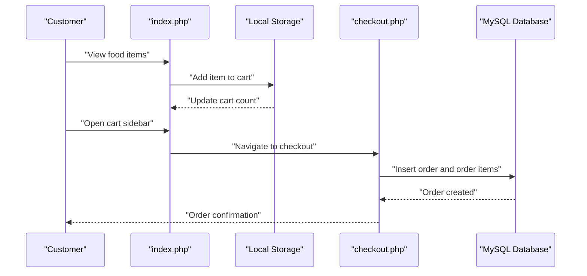
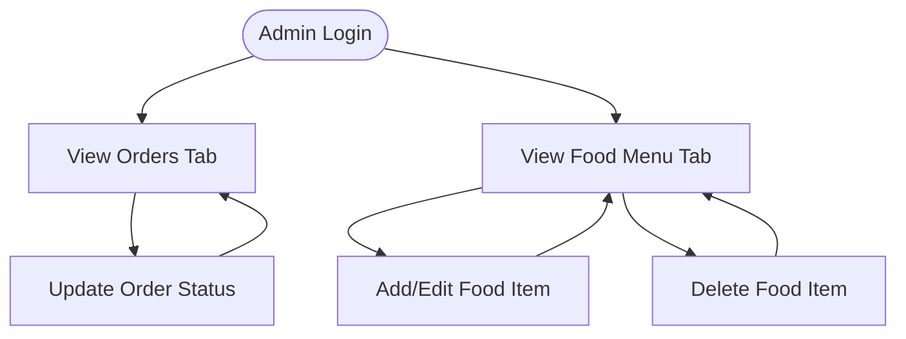

# Getting Started

<cite>
**Referenced Files in This Document**
- [config.php](file://config.php)
- [database.sql](file://database.sql)
- [index.php](file://index.php)
- [admin.php](file://admin.php)
- [checkout.php](file://checkout.php)
- [orders.php](file://orders.php)
- [style.css](file://style.css)
</cite>

## Table of Contents
1. [Introduction](#introduction)
2. [Prerequisites](#prerequisites)
3. [Installation Steps](#installation-steps)
4. [Database Setup](#database-setup)
5. [File Deployment](#file-deployment)
6. [Initial Configuration](#initial-configuration)
7. [Verification](#verification)
8. [Basic Usage](#basic-usage)
9. [Administrator Interface](#administrator-interface)
10. [Troubleshooting](#troubleshooting)
11. [Conclusion](#conclusion)

## Introduction
This guide helps you install and run the Food Delivery System locally using XAMPP or WAMP. The system includes a customer-facing website for browsing food items, adding them to cart, and placing orders, plus an administrator panel for managing orders and food menu items.

## Prerequisites
- Local server environment:
  - XAMPP (Apache + MySQL) or WAMP (Apache + MySQL + PHP)
- PHP version: 7.0 or higher
- Web browser (Chrome, Firefox, Edge)
- Basic familiarity with local development servers

## Installation Steps

### Step 1: Start Local Server
- Launch XAMPP or WAMP and start Apache and MySQL services.
- Verify Apache is running by visiting http://localhost in your browser.

### Step 2: Prepare Project Folder
- Place the project folder named `food` inside the web root directory:
  - XAMPP: `C:\xampp\htdocs\food\`
  - WAMP: `C:\wamp64\www\food\`

### Step 3: Access the Application
- Open your browser and navigate to:
  - http://localhost/food/index.php

**Section sources**
- [index.php:1-203](file://index.php#L1-L203)

## Database Setup

### Step 1: Create Database and Tables
- Open phpMyAdmin (usually at http://localhost/phpmyadmin)
- Create a new database named `food_delivery`
- Import the SQL schema from the provided file:
  - File: `database.sql`
  - This script creates the database, sets UTF-8mb4 character set, and defines tables for foods, orders, and order items with sample data

### Step 2: Verify Database Objects
After importing, confirm:
- Database: `food_delivery`
- Tables: `foods`, `orders`, `order_items`
- Sample food items inserted into the `foods` table

**Section sources**
- [database.sql:1-54](file://database.sql#L1-L54)

## File Deployment

### Deploy Files to htdocs
- Copy all project files into the `food` directory under your web root:
  - `index.php`, `admin.php`, `checkout.php`, `orders.php`, `config.php`, `database.sql`, `style.css`
- Ensure file permissions allow the web server to read these files

### Confirm File Accessibility
- Visit http://localhost/food/ to confirm all pages load without errors
- Check that styles render correctly via `style.css`

**Section sources**
- [style.css:1-610](file://style.css#L1-L610)

## Initial Configuration

### Database Credentials
- Edit the database configuration in `config.php` to match your local setup:
  - Host: `localhost`
  - Username: `root`
  - Password: (leave blank if no password set)
  - Database name: `food_delivery`
- Save the file after editing

### Administrator Password
- The default administrator password is defined in `config.php`:
  - Default admin password: `123`
- Use this password to log into the admin panel

**Section sources**
- [config.php:1-71](file://config.php#L1-L71)

## Verification

### Test Customer Interface
- Navigate to http://localhost/food/index.php
- Browse food categories and items
- Add items to cart using the "Savatga" button
- Proceed to checkout and place an order

### Test Administrator Interface
- Navigate to http://localhost/food/admin.php
- Enter the admin password (`123`)
- Manage orders and food menu items

### Verify Database Connectivity
- Check that orders placed appear in the admin panel
- Confirm order history displays correctly in the customer orders page

**Section sources**
- [index.php:1-203](file://index.php#L1-L203)
- [admin.php:1-312](file://admin.php#L1-L312)
- [orders.php:1-137](file://orders.php#L1-L137)

## Basic Usage

### Customer Workflow
1. Browse food items on the homepage
2. Filter by category using the category buttons
3. Add items to cart using the "Savatga" button
4. Adjust quantities in the cart sidebar
5. Proceed to checkout to enter delivery details
6. Submit the order and receive confirmation

**Diagram sources**
- [index.php:143-196](file://index.php#L143-L196)
- [checkout.php:4-36](file://checkout.php#L4-L36)

### Order Management (Customer)
- Access order history via http://localhost/food/orders.php
- Search orders by phone number to view details and status

**Section sources**
- [orders.php:1-137](file://orders.php#L1-L137)

## Administrator Interface

### Login
- Navigate to http://localhost/food/admin.php
- Enter the admin password (`123`) to access the panel

### Managing Orders
- View all orders in the "Buyurtmalar" tab
- Update order status using the dropdown controls
- Orders support statuses: pending, preparing, ready, delivered

### Managing Food Menu
- Switch to the "Taomlar" tab
- Add new food items or edit existing ones
- Categories supported: Lavash, Burger, Pizza, Ichimliklar, Osh

**Diagram sources**
- [admin.php:22-60](file://admin.php#L22-L60)
- [admin.php:32-60](file://admin.php#L32-L60)

**Section sources**
- [admin.php:1-312](file://admin.php#L1-L312)

## Troubleshooting

### Common Issues and Fixes

#### Cannot Connect to Database
- Verify MySQL service is running in XAMPP/WAMP
- Confirm database name in `config.php` matches the created database (`food_delivery`)
- Ensure the database was created with UTF-8mb4 character set

#### Blank Page or Fatal Error
- Check PHP error logs in XAMPP/WAMP control panel
- Verify all required files are present in the `food` directory
- Ensure file permissions allow the web server to read files

#### Styles Not Loading
- Confirm `style.css` is accessible at http://localhost/food/style.css
- Check browser console for CSS loading errors

#### Orders Not Appearing in Admin Panel
- Verify the `orders` and `order_items` tables were created during import
- Check that orders are being inserted into the database during checkout

#### Cart Issues
- Ensure JavaScript is enabled in the browser
- Clear browser cache and reload the page
- Check that local storage is enabled

**Section sources**
- [config.php:10-20](file://config.php#L10-L20)
- [database.sql:3-40](file://database.sql#L3-L40)

## Conclusion
You have successfully installed and configured the Food Delivery System. The customer interface allows browsing, ordering, and checking order status, while the administrator panel enables order management and menu maintenance. Use the troubleshooting section if you encounter issues during setup or operation.