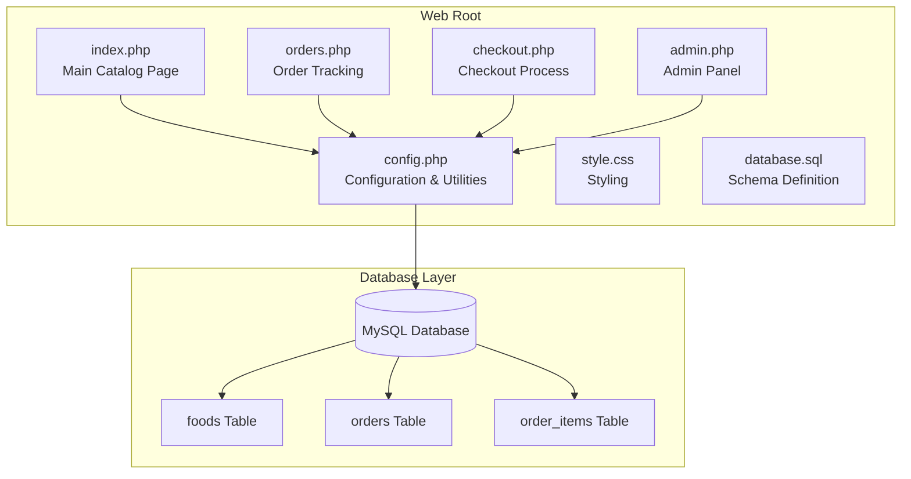
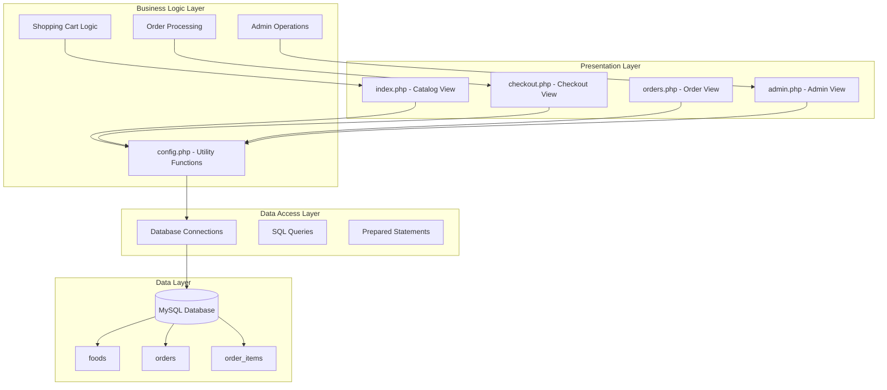
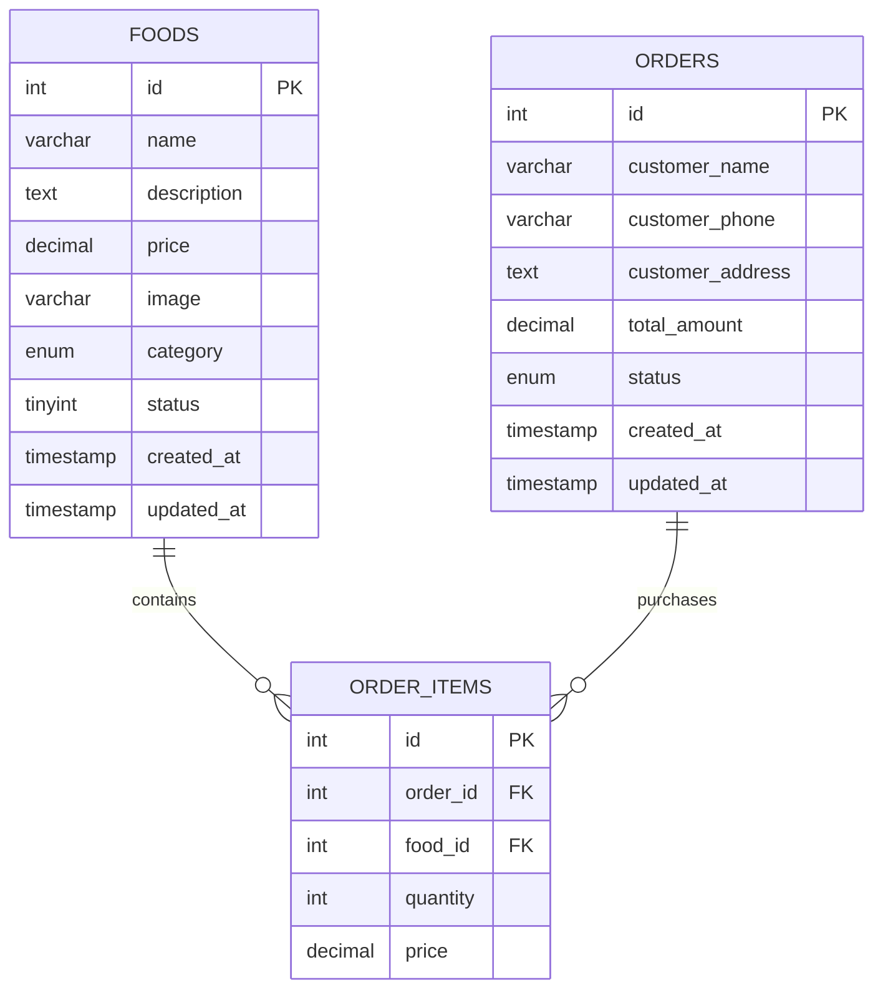
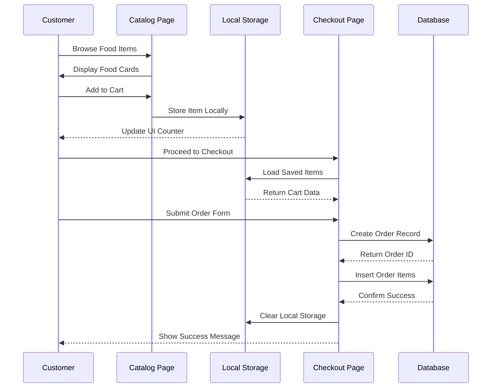
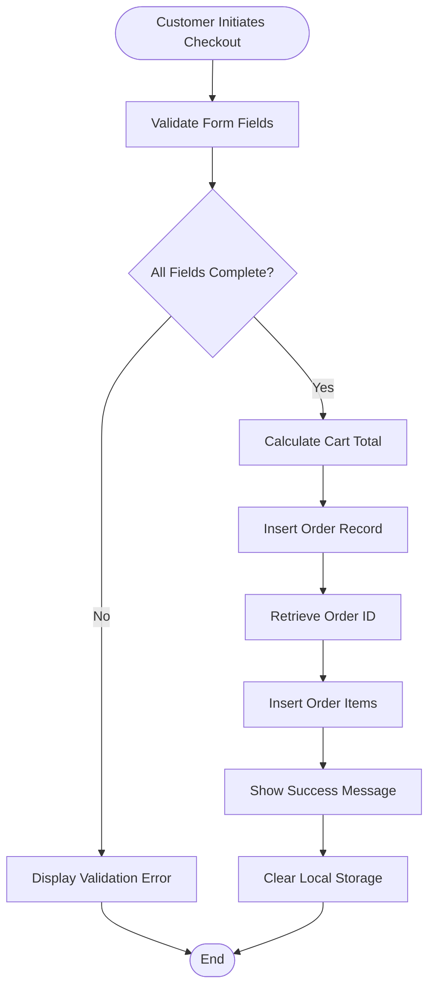
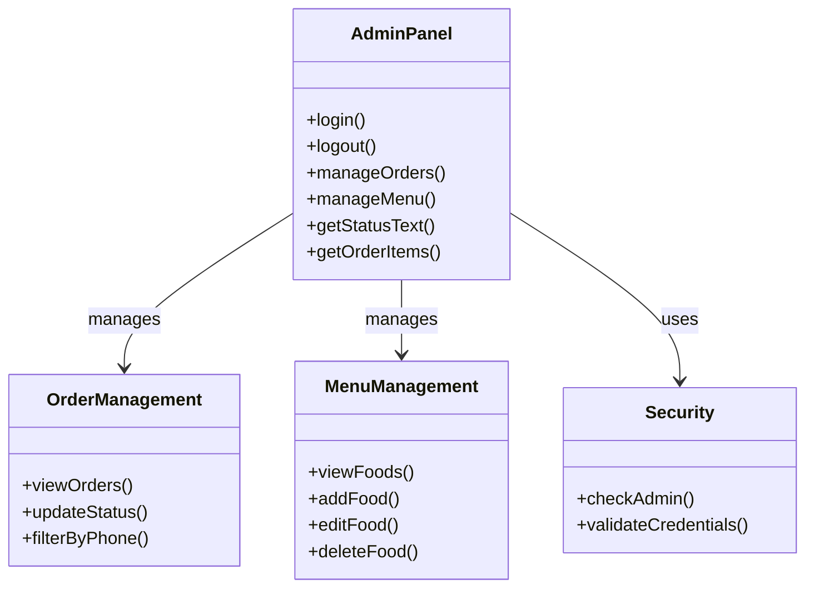
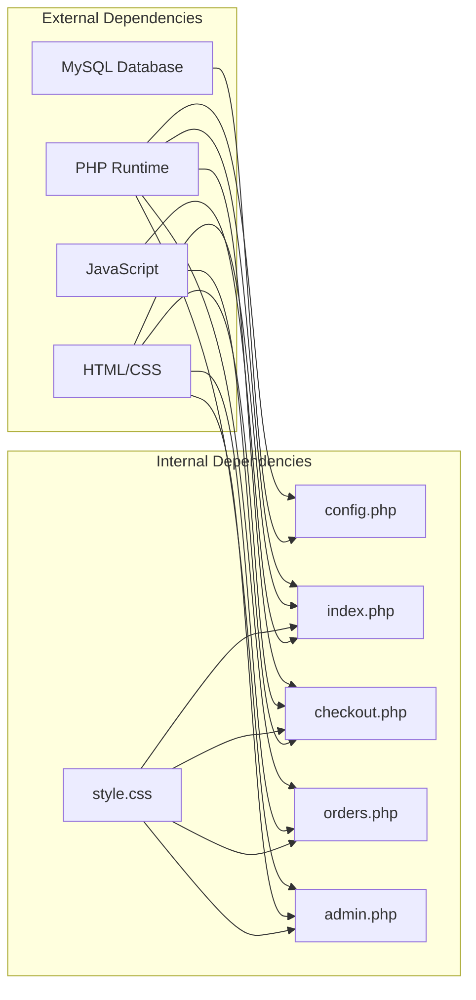

# Project Overview

<cite>
**Referenced Files in This Document**
- [index.php](file://index.php)
- [admin.php](file://admin.php)
- [checkout.php](file://checkout.php)
- [orders.php](file://orders.php)
- [config.php](file://config.php)
- [database.sql](file://database.sql)
- [style.css](file://style.css)
</cite>

## Table of Contents
1. [Introduction](#introduction)
2. [Project Structure](#project-structure)
3. [Core Components](#core-components)
4. [Architecture Overview](#architecture-overview)
5. [Detailed Component Analysis](#detailed-component-analysis)
6. [Dependency Analysis](#dependency-analysis)
7. [Performance Considerations](#performance-considerations)
8. [Troubleshooting Guide](#troubleshooting-guide)
9. [Conclusion](#conclusion)

## Introduction
This document provides a comprehensive overview of the Food Delivery System, a complete web-based food ordering and delivery management solution built with PHP and MySQL. The system targets two primary audiences:
- Students learning web development who want to understand practical implementation of client-server interactions, database design, and user interface patterns
- Small restaurant owners seeking a lightweight, functional platform to manage menu offerings and customer orders

The system implements essential e-commerce workflows including customer food browsing, shopping cart management, order placement, order tracking, and administrative order/menu management. It demonstrates fundamental web development concepts such as form handling, database transactions, session management, and responsive design.

## Project Structure
The project follows a straightforward file-based organization with clear separation of concerns:

**Diagram sources**
- [index.php:1-203](file://index.php#L1-L203)
- [admin.php:1-312](file://admin.php#L1-L312)
- [checkout.php:1-127](file://checkout.php#L1-L127)
- [orders.php:1-137](file://orders.php#L1-L137)
- [config.php:1-71](file://config.php#L1-L71)
- [database.sql:1-54](file://database.sql#L1-L54)

**Section sources**
- [index.php:1-203](file://index.php#L1-L203)
- [admin.php:1-312](file://admin.php#L1-L312)
- [checkout.php:1-127](file://checkout.php#L1-L127)
- [orders.php:1-137](file://orders.php#L1-L137)
- [config.php:1-71](file://config.php#L1-L71)
- [database.sql:1-54](file://database.sql#L1-L54)

## Core Components
The system consists of five primary components that work together to deliver the complete food delivery experience:

### Frontend Pages
- **Catalog Page (index.php)**: Displays available food items with category filtering and shopping cart functionality
- **Checkout Page (checkout.php)**: Processes customer order submission with form validation
- **Order Tracking (orders.php)**: Allows customers to search and view their order history
- **Admin Panel (admin.php)**: Provides administrative controls for order management and menu maintenance

### Backend Services
- **Configuration Module (config.php)**: Centralizes database connections, utility functions, and shared constants
- **Database Schema (database.sql)**: Defines the relational model for foods, orders, and order items

### Design Features
- **Responsive Layout**: Mobile-first design with adaptive grid systems
- **Interactive Shopping Cart**: Client-side cart management with local storage persistence
- **Real-time Updates**: Dynamic UI updates without page reloads
- **Status Management**: Visual indicators for order states (pending, preparing, ready, delivered)

**Section sources**
- [index.php:16-78](file://index.php#L16-L78)
- [checkout.php:47-104](file://checkout.php#L47-L104)
- [orders.php:46-134](file://orders.php#L46-L134)
- [admin.php:106-311](file://admin.php#L106-L311)
- [config.php:10-71](file://config.php#L10-L71)

## Architecture Overview
The system implements a simplified Model-View-Controller (MVC) pattern with clear separation between presentation, business logic, and data access layers:

**Diagram sources**
- [index.php:1-203](file://index.php#L1-L203)
- [checkout.php:1-127](file://checkout.php#L1-L127)
- [orders.php:1-137](file://orders.php#L1-L137)
- [admin.php:1-312](file://admin.php#L1-L312)
- [config.php:1-71](file://config.php#L1-L71)

The architecture emphasizes simplicity and educational value:
- **Single Responsibility Principle**: Each file has a focused purpose
- **Separation of Concerns**: Presentation logic is separate from business logic
- **Reusability**: Shared functions in config.php reduce code duplication
- **Security**: Prepared statements prevent SQL injection attacks

## Detailed Component Analysis

### Database Design
The system employs a normalized relational schema optimized for simplicity and performance:

**Diagram sources**
- [database.sql:6-40](file://database.sql#L6-L40)

Key design decisions:
- **foods table**: Stores menu items with categorization and pricing
- **orders table**: Tracks customer orders with status tracking
- **order_items table**: Junction table linking orders to specific food items
- **Category Enumeration**: Predefined categories ensure data consistency
- **Status Tracking**: Enumerated statuses provide clear workflow states

### Shopping Cart Implementation
The cart system combines client-side and server-side persistence:

**Diagram sources**
- [index.php:101-200](file://index.php#L101-L200)
- [checkout.php:4-36](file://checkout.php#L4-L36)

Implementation highlights:
- **Local Storage Persistence**: Cart data survives page refreshes
- **Real-time Updates**: Cart counter and totals update immediately
- **Quantity Management**: Increment/decrement functionality with validation
- **Cross-page Synchronization**: Cart state maintained across navigation

### Order Processing Workflow
The checkout process ensures data integrity and provides clear feedback:

**Diagram sources**
- [checkout.php:4-36](file://checkout.php#L4-L36)

Security measures implemented:
- **Input Validation**: Server-side validation prevents empty submissions
- **Data Type Casting**: Explicit conversion ensures numeric values
- **Database Transactions**: Atomic operations maintain data consistency
- **Prepared Statements**: Prevents SQL injection vulnerabilities

### Administrative Interface
The admin panel provides comprehensive management capabilities:

**Diagram sources**
- [admin.php:1-312](file://admin.php#L1-L312)

Administrative features:
- **Order Status Control**: Real-time order state updates
- **Menu Maintenance**: CRUD operations for food items
- **Search Functionality**: Phone-based order lookup
- **Visual Status Indicators**: Color-coded status badges
- **Form Validation**: Comprehensive input sanitization

**Section sources**
- [database.sql:1-54](file://database.sql#L1-L54)
- [index.php:101-200](file://index.php#L101-L200)
- [checkout.php:4-36](file://checkout.php#L4-L36)
- [admin.php:1-312](file://admin.php#L1-L312)

## Dependency Analysis
The system exhibits minimal coupling with clear dependency relationships:

**Diagram sources**
- [config.php:1-71](file://config.php#L1-L71)
- [index.php:1-203](file://index.php#L1-L203)
- [checkout.php:1-127](file://checkout.php#L1-L127)
- [orders.php:1-137](file://orders.php#L1-L137)
- [admin.php:1-312](file://admin.php#L1-L312)

Key dependency characteristics:
- **Centralized Configuration**: All pages depend on config.php for database connectivity
- **Shared Utilities**: Common functions reduce code duplication
- **Minimal External Libraries**: Uses only native PHP and MySQL capabilities
- **CSS Reusability**: Single stylesheet shared across all pages

**Section sources**
- [config.php:1-71](file://config.php#L1-L71)
- [index.php:1-203](file://index.php#L1-L203)
- [checkout.php:1-127](file://checkout.php#L1-L127)
- [orders.php:1-137](file://orders.php#L1-L137)
- [admin.php:1-312](file://admin.php#L1-L312)

## Performance Considerations
The system is designed for optimal performance given its scope:

### Database Optimization
- **Index-Free Design**: Simple schema reduces overhead for small datasets
- **Efficient Queries**: Targeted SELECT statements with appropriate WHERE clauses
- **Connection Pooling**: Singleton pattern prevents excessive database connections
- **Prepared Statements**: Compiled queries improve execution speed

### Frontend Performance
- **Static Assets**: CSS and JavaScript loaded once, cached by browsers
- **Minimal DOM Manipulation**: Efficient cart updates using innerHTML
- **Responsive Images**: Optimized for various screen sizes
- **Local Storage**: Reduces server requests for cart data

### Scalability Limitations
- **Single Database Instance**: Suitable for small to medium restaurants
- **No Pagination**: Current design assumes manageable dataset sizes
- **Simple Authentication**: Basic admin login suitable for trusted environments

## Troubleshooting Guide

### Common Issues and Solutions

#### Database Connection Problems
**Symptoms**: White page or connection errors on all pages
**Causes**: Incorrect database credentials or MySQL service not running
**Solutions**:
- Verify database credentials in config.php match your MySQL setup
- Ensure MySQL service is running and accessible
- Check database existence and permissions

#### Session Management Issues
**Symptoms**: Admin login redirects without authentication
**Causes**: Session not starting or browser cookie restrictions
**Solutions**:
- Verify session_start() executes before any output
- Check browser cookie settings and privacy controls
- Clear browser cache and cookies

#### Cart Data Loss
**Symptoms**: Shopping cart resets after page refresh
**Causes**: Browser storage limitations or privacy settings
**Solutions**:
- Verify browser supports localStorage
- Check for private browsing mode restrictions
- Clear browser storage if corrupted

#### Order Submission Failures
**Symptoms**: Form submits but no order appears in database
**Causes**: Validation errors or database transaction failures
**Solutions**:
- Check server error logs for detailed messages
- Verify database table creation and permissions
- Test individual form field requirements

**Section sources**
- [config.php:10-20](file://config.php#L10-L20)
- [config.php:67-71](file://config.php#L67-L71)
- [checkout.php:4-12](file://checkout.php#L4-L12)

## Conclusion
The Food Delivery System represents an excellent educational project that demonstrates fundamental web development principles in a practical, real-world context. Its clean architecture, comprehensive feature set, and focus on user experience make it ideal for both learning and deployment scenarios.

### Educational Value
- **Complete Workflow**: Implements end-to-end e-commerce functionality
- **Security Best Practices**: Demonstrates prepared statements and input validation
- **Modern Web Techniques**: Responsive design and client-side interactivity
- **Database Design**: Practical example of normalized relational schema

### Practical Benefits
- **Lightweight Solution**: Minimal resource requirements suitable for small businesses
- **Easy Deployment**: Simple installation process with clear documentation
- **Extensible Foundation**: Modular design allows for future enhancements
- **Cost Effective**: Free open-source stack reduces implementation costs

### Future Enhancement Opportunities
- **User Authentication**: Customer registration and account management
- **Payment Integration**: Stripe or local payment gateway support
- **Delivery Tracking**: Real-time location sharing and notifications
- **Reporting Dashboard**: Sales analytics and inventory management
- **Mobile Application**: Native app development for iOS and Android

The system successfully bridges the gap between theoretical knowledge and practical application, providing students with hands-on experience while delivering a functional solution for small restaurant operations.