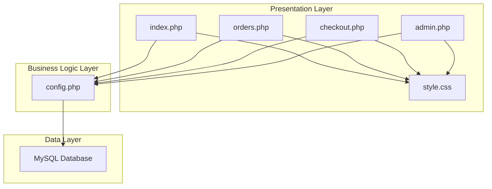
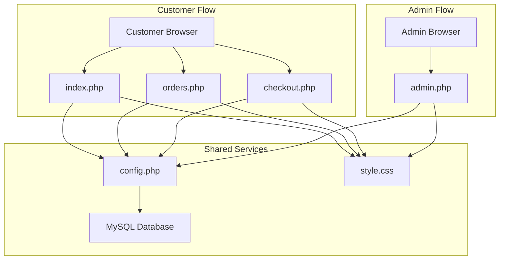
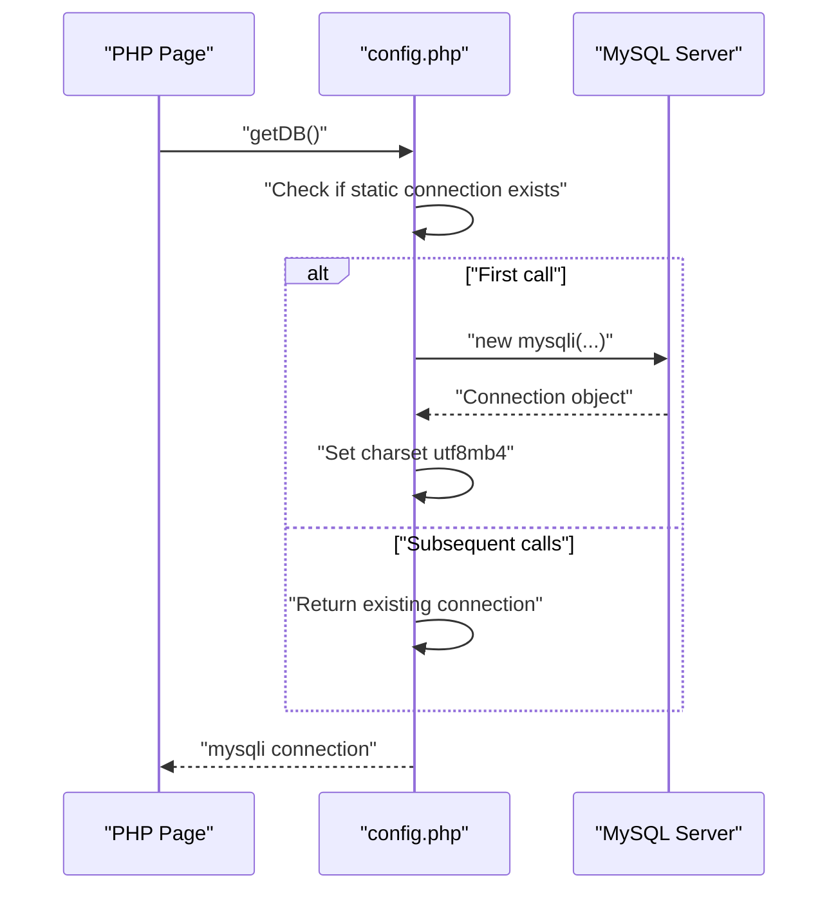
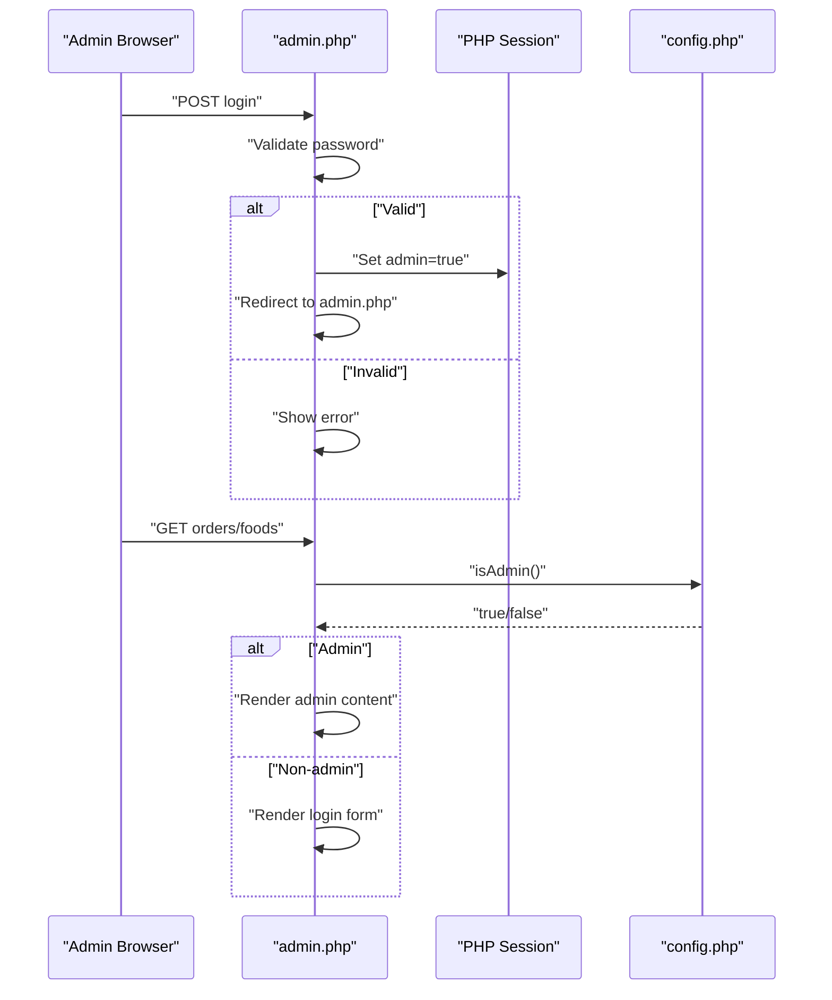
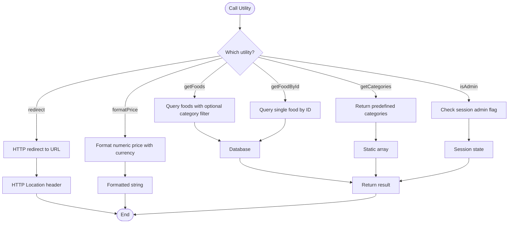
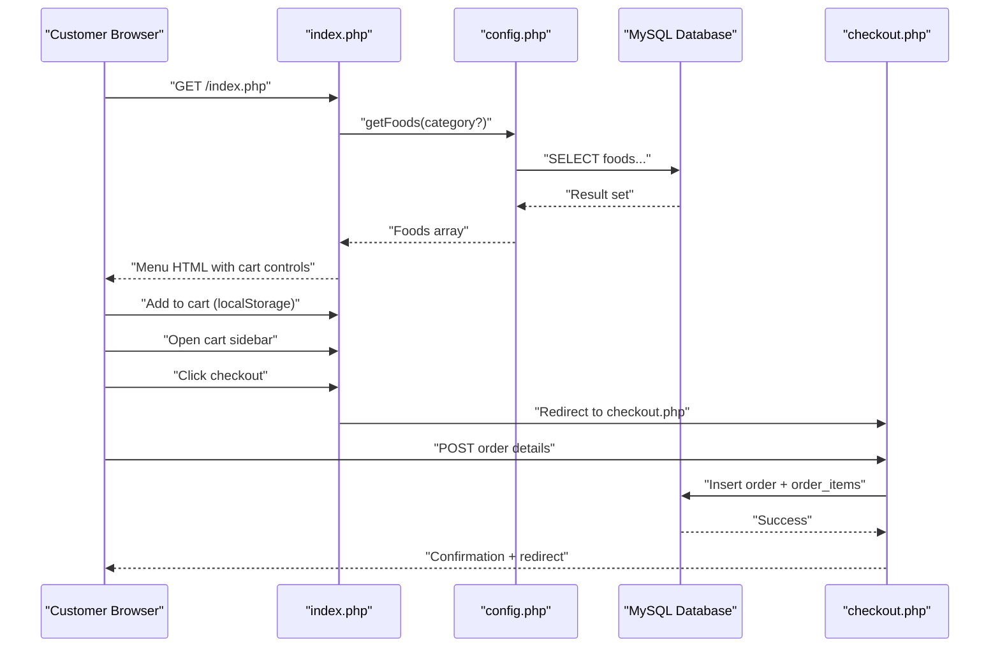
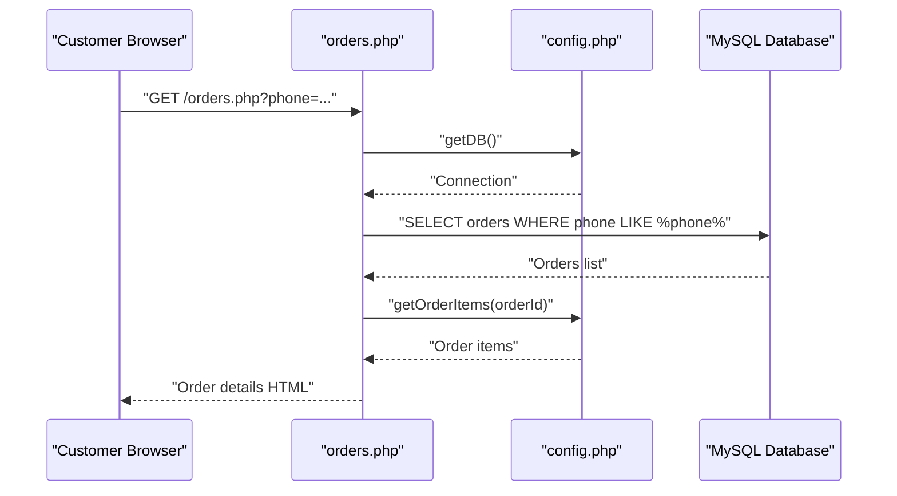
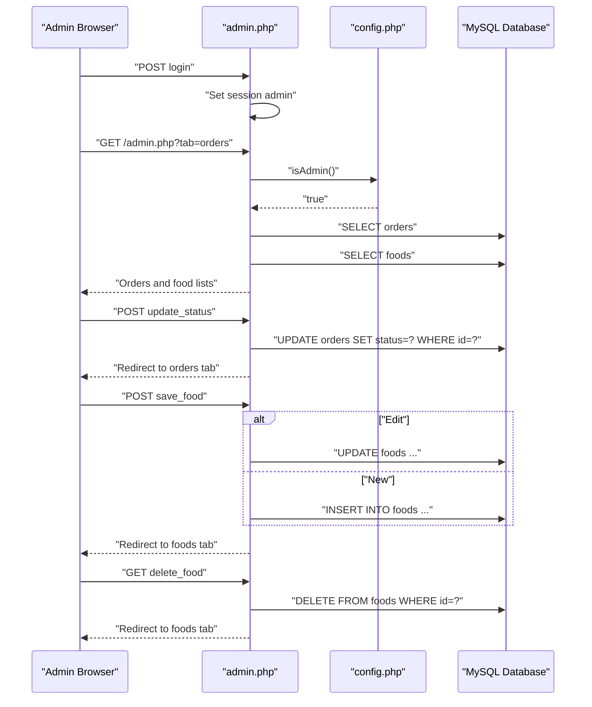
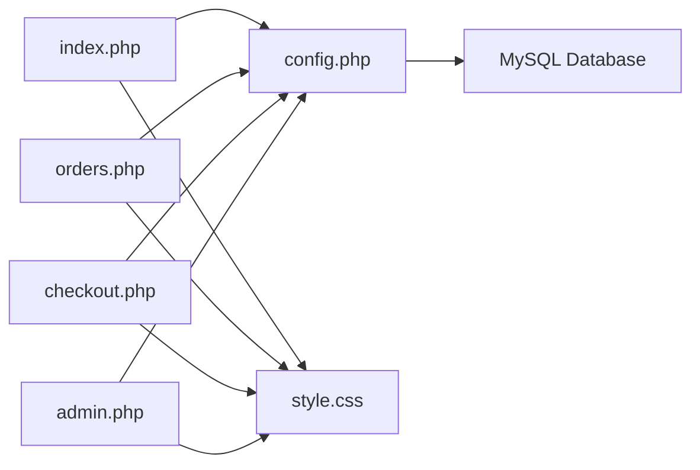

# System Architecture

<cite>
**Referenced Files in This Document**
- [config.php](file://config.php)
- [index.php](file://index.php)
- [admin.php](file://admin.php)
- [orders.php](file://orders.php)
- [checkout.php](file://checkout.php)
- [style.css](file://style.css)
- [database.sql](file://database.sql)
</cite>

## Table of Contents
1. [Introduction](#introduction)
2. [Project Structure](#project-structure)
3. [Core Components](#core-components)
4. [Architecture Overview](#architecture-overview)
5. [Detailed Component Analysis](#detailed-component-analysis)
6. [Dependency Analysis](#dependency-analysis)
7. [Performance Considerations](#performance-considerations)
8. [Troubleshooting Guide](#troubleshooting-guide)
9. [Conclusion](#conclusion)

## Introduction
This document describes the architectural design of a Food Delivery System built with PHP and MySQL. The system follows a simplified Model-View-Controller (MVC) pattern with clear separation between:
- Data layer: centralized database configuration and utility functions
- Presentation layer: PHP-driven HTML templates with shared styles
- Business logic: request handling, validation, and data manipulation

Key architectural patterns include:
- Singleton-like database connection via a global utility function
- Session-based authentication for administrative access
- Centralized utility functions for database operations, formatting, and navigation
- Stateless presentation pages with minimal embedded logic

## Project Structure
The project consists of seven files organized around a flat MVC structure:
- config.php: central configuration, database connection, and utility functions
- index.php: customer-facing menu and shopping interface
- orders.php: customer order history/search page
- checkout.php: order placement form and confirmation
- admin.php: administrative panel for managing orders and food items
- style.css: shared presentation styling
- database.sql: database schema and sample data

**Diagram sources**
- [config.php:1-71](file://config.php#L1-L71)
- [index.php:1-203](file://index.php#L1-L203)
- [orders.php:1-137](file://orders.php#L1-L137)
- [checkout.php:1-127](file://checkout.php#L1-L127)
- [admin.php:1-312](file://admin.php#L1-L312)
- [style.css:1-610](file://style.css#L1-L610)

**Section sources**
- [config.php:1-71](file://config.php#L1-L71)
- [index.php:1-203](file://index.php#L1-L203)
- [orders.php:1-137](file://orders.php#L1-L137)
- [checkout.php:1-127](file://checkout.php#L1-L127)
- [admin.php:1-312](file://admin.php#L1-L312)
- [style.css:1-610](file://style.css#L1-L610)
- [database.sql:1-54](file://database.sql#L1-L54)

## Core Components
This section documents the primary components and their roles in the system.

- config.php
  - Provides database constants and a singleton-like connection function
  - Exposes utility functions for formatting prices, retrieving foods and categories, and session-based admin checks
  - Starts sessions automatically if not already started
  - Redirects users to specified URLs

- index.php
  - Customer menu page with category filtering and cart management
  - Uses localStorage for client-side cart persistence
  - Integrates with config.php for data retrieval and formatting

- orders.php
  - Allows customers to search their orders by phone number
  - Displays order details and associated items

- checkout.php
  - Processes order creation and payment submission
  - Calculates totals and persists order data to the database

- admin.php
  - Administrative login and session management
  - Manages order statuses and food inventory
  - Provides forms for adding, editing, and deleting food items

- style.css
  - Shared styling for all pages, including responsive design and UI components

**Section sources**
- [config.php:1-71](file://config.php#L1-L71)
- [index.php:1-203](file://index.php#L1-L203)
- [orders.php:1-137](file://orders.php#L1-L137)
- [checkout.php:1-127](file://checkout.php#L1-L127)
- [admin.php:1-312](file://admin.php#L1-L312)
- [style.css:1-610](file://style.css#L1-L610)

## Architecture Overview
The system implements a simplified MVC pattern:
- Model: represented by database tables and centralized utility functions in config.php
- View: PHP-generated HTML pages (index.php, orders.php, checkout.php, admin.php) styled by style.css
- Controller: PHP scripts handle requests, validate input, and orchestrate data retrieval and updates

**Diagram sources**
- [config.php:1-71](file://config.php#L1-L71)
- [index.php:1-203](file://index.php#L1-L203)
- [orders.php:1-137](file://orders.php#L1-L137)
- [checkout.php:1-127](file://checkout.php#L1-L127)
- [admin.php:1-312](file://admin.php#L1-L312)
- [style.css:1-610](file://style.css#L1-L610)

## Detailed Component Analysis

### Database Connection Pattern (Singleton-like)
The system uses a centralized database connection function that behaves like a singleton:
- Ensures a single mysqli connection instance per request
- Sets UTF-8 character set for consistent data handling
- Handles connection errors by terminating execution with an error message

**Diagram sources**
- [config.php:10-20](file://config.php#L10-L20)

**Section sources**
- [config.php:10-20](file://config.php#L10-L20)

### Session-Based Authentication System
Administrative access is controlled via session variables:
- Login sets a session flag indicating admin privileges
- Logout clears the session and redirects to the admin page
- Pages check for admin status before rendering admin-specific content

**Diagram sources**
- [admin.php:4-17](file://admin.php#L4-L17)
- [config.php:56-65](file://config.php#L56-L65)

**Section sources**
- [admin.php:4-17](file://admin.php#L4-L17)
- [config.php:56-65](file://config.php#L56-L65)

### Centralized Utility Functions Approach
Utility functions encapsulate common operations:
- Data retrieval: getFoods(), getFoodById(), getCategories()
- Formatting: formatPrice()
- Navigation: redirect()
- Authentication: isAdmin()

**Diagram sources**
- [config.php:27-54](file://config.php#L27-L54)
- [config.php:56-65](file://config.php#L56-L65)

**Section sources**
- [config.php:27-54](file://config.php#L27-L54)
- [config.php:56-65](file://config.php#L56-L65)

### Customer Interface Flow
The customer journey involves browsing menu items, managing a cart, and placing orders.

**Diagram sources**
- [index.php:1-203](file://index.php#L1-L203)
- [config.php:27-54](file://config.php#L27-L54)
- [checkout.php:1-127](file://checkout.php#L1-L127)

**Section sources**
- [index.php:1-203](file://index.php#L1-L203)
- [checkout.php:1-127](file://checkout.php#L1-L127)

### Order Management Flow
Order management spans customer and administrative views.

**Diagram sources**
- [orders.php:1-137](file://orders.php#L1-L137)
- [config.php:27-54](file://config.php#L27-L54)

**Section sources**
- [orders.php:1-137](file://orders.php#L1-L137)

### Administrative Functions Flow
Administrators can manage orders and food inventory.

**Diagram sources**
- [admin.php:1-312](file://admin.php#L1-L312)
- [config.php:56-65](file://config.php#L56-L65)

**Section sources**
- [admin.php:1-312](file://admin.php#L1-L312)

## Dependency Analysis
The system exhibits a unidirectional dependency chain from presentation to business logic to data.

**Diagram sources**
- [index.php:1-203](file://index.php#L1-L203)
- [orders.php:1-137](file://orders.php#L1-L137)
- [checkout.php:1-127](file://checkout.php#L1-L127)
- [admin.php:1-312](file://admin.php#L1-L312)
- [config.php:1-71](file://config.php#L1-L71)
- [style.css:1-610](file://style.css#L1-L610)

**Section sources**
- [index.php:1-203](file://index.php#L1-L203)
- [orders.php:1-137](file://orders.php#L1-L137)
- [checkout.php:1-127](file://checkout.php#L1-L127)
- [admin.php:1-312](file://admin.php#L1-L312)
- [config.php:1-71](file://config.php#L1-L71)
- [style.css:1-610](file://style.css#L1-L610)

## Performance Considerations
- Database connections: The singleton-like connection reduces overhead but keeps connections open for the duration of the request lifecycle. Consider closing connections explicitly if scaling horizontally.
- Prepared statements: Used consistently for all dynamic queries, preventing SQL injection and improving performance through statement caching.
- Client-side cart: LocalStorage usage avoids server round-trips for cart operations, improving perceived responsiveness.
- Category filtering: Efficient server-side filtering with prepared statements and optional category parameterization.
- Admin operations: Batch operations (bulk order status updates) are handled server-side with minimal client interaction.

## Troubleshooting Guide
Common issues and resolutions:
- Database connectivity failures: Verify database credentials and availability; the connection function terminates execution on failure.
- Session-related problems: Ensure sessions are started before accessing session variables; the configuration file starts sessions automatically.
- Missing or invalid data: Input validation occurs on checkout; ensure required fields are present before submission.
- Admin access denied: Confirm correct password and that session admin flag is set upon successful login.
- Styling inconsistencies: All pages share style.css; verify the stylesheet path and browser cache clearing if styles appear outdated.

**Section sources**
- [config.php:10-20](file://config.php#L10-L20)
- [config.php:67-71](file://config.php#L67-L71)
- [checkout.php:4-36](file://checkout.php#L4-L36)
- [admin.php:5-11](file://admin.php#L5-L11)

## Conclusion
The Food Delivery System demonstrates a clean, educational architecture that separates concerns effectively:
- Data: centralized configuration and utilities
- Presentation: modular PHP templates with shared styling
- Business logic: focused request handling and data operations

The design choices—singleton-like database connection, session-based admin authentication, and centralized utilities—provide a practical foundation suitable for learning while maintaining real-world functionality. The system’s simplicity makes it easy to extend with additional features such as user accounts, payment processing, or advanced reporting.