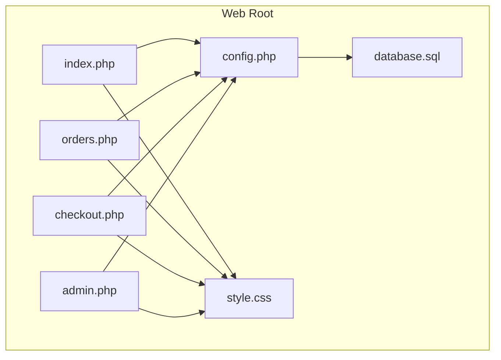
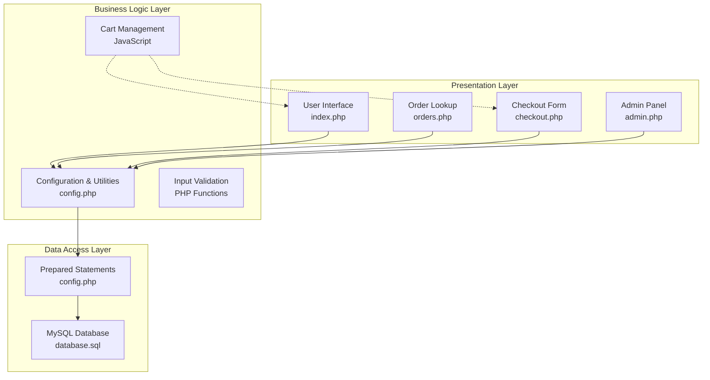
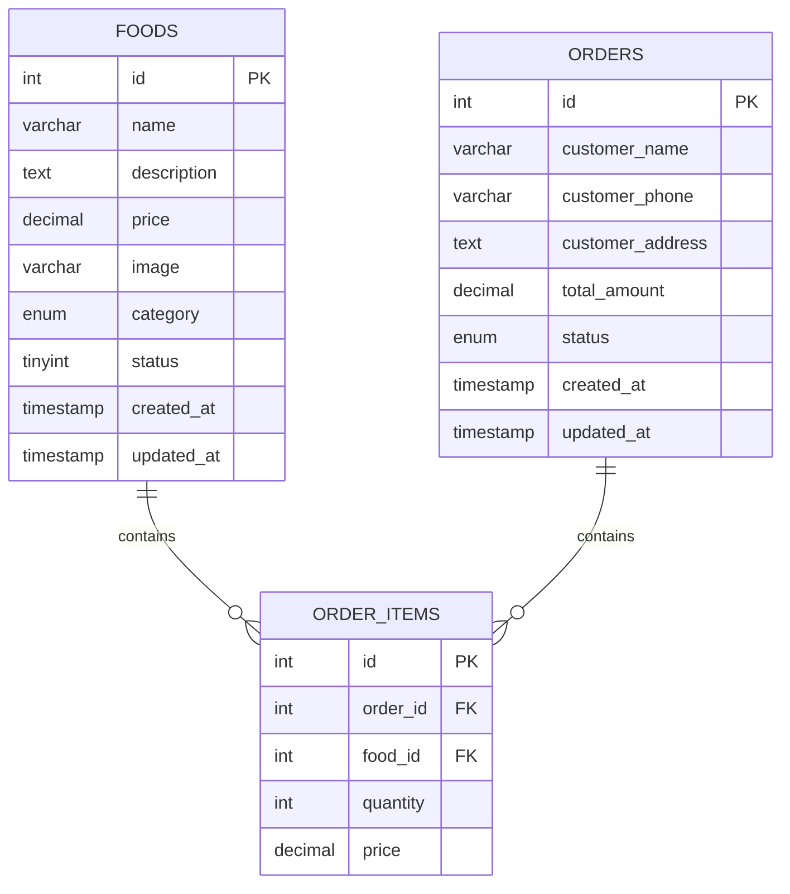
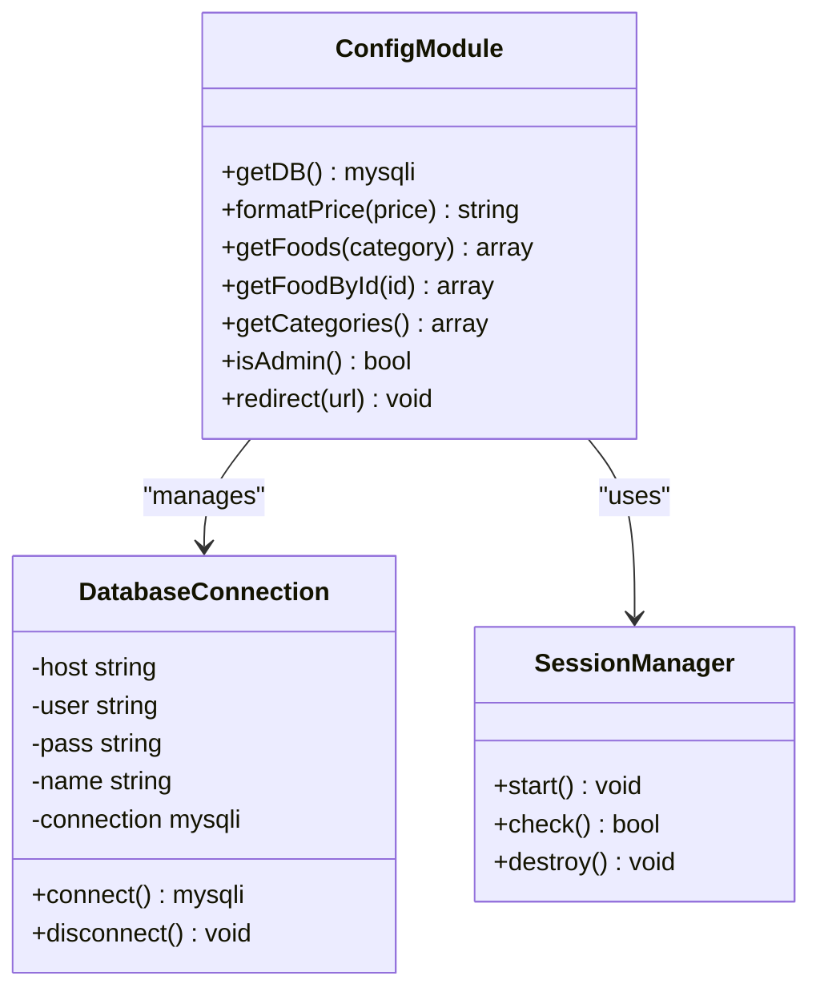
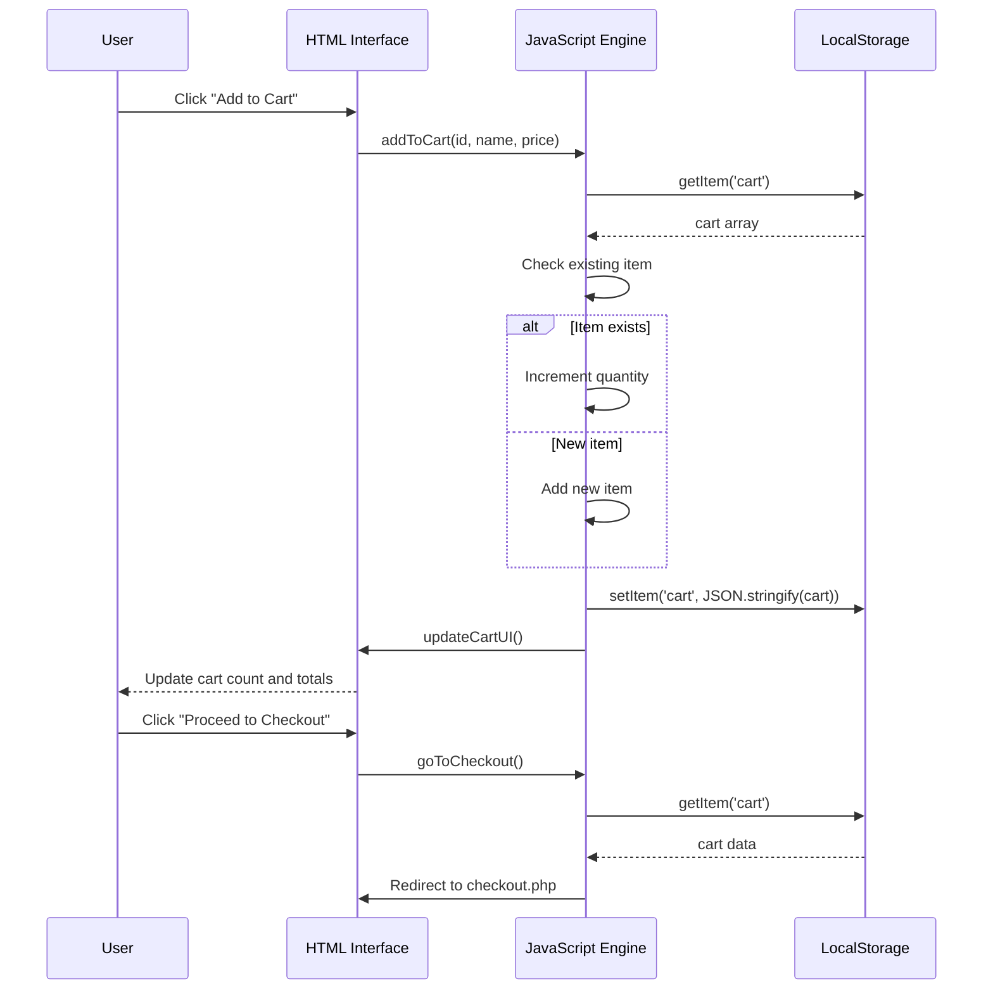
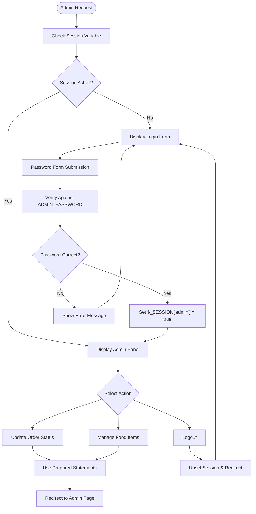
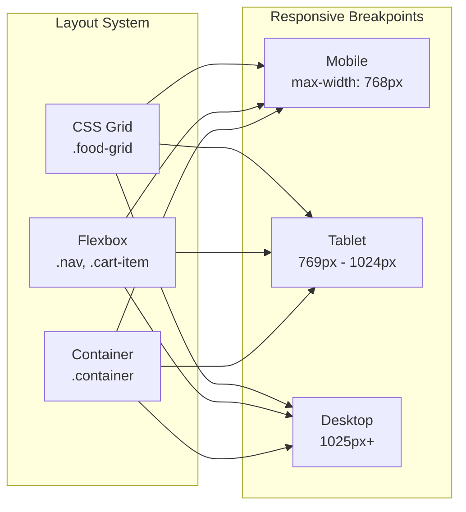
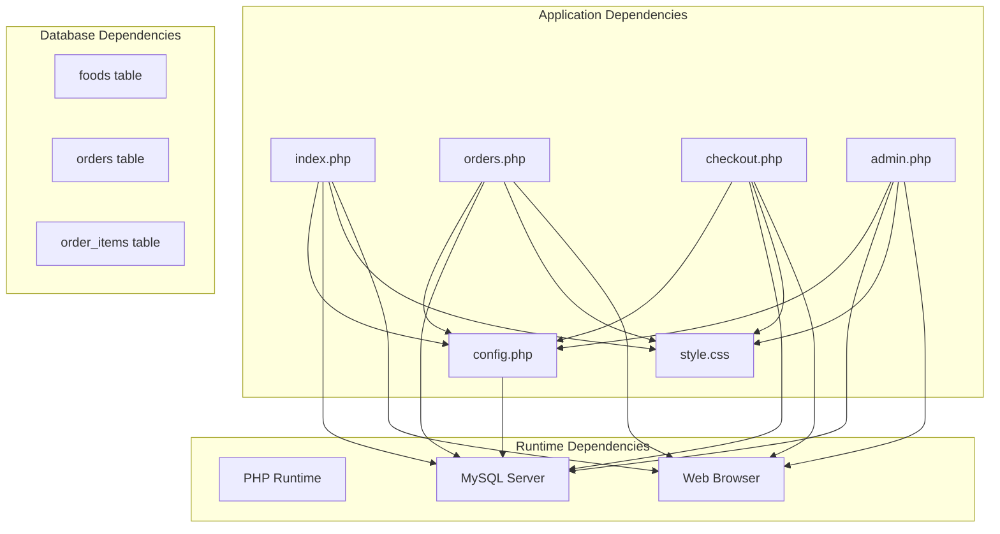

# Technical Implementation

<cite>
**Referenced Files in This Document**
- [index.php](file://index.php)
- [admin.php](file://admin.php)
- [checkout.php](file://checkout.php)
- [orders.php](file://orders.php)
- [config.php](file://config.php)
- [database.sql](file://database.sql)
- [style.css](file://style.css)
</cite>

## Table of Contents
1. [Introduction](#introduction)
2. [Project Structure](#project-structure)
3. [Core Components](#core-components)
4. [Architecture Overview](#architecture-overview)
5. [Detailed Component Analysis](#detailed-component-analysis)
6. [Dependency Analysis](#dependency-analysis)
7. [Performance Considerations](#performance-considerations)
8. [Security Considerations](#security-considerations)
9. [Code Quality Guidelines](#code-quality-guidelines)
10. [Troubleshooting Guide](#troubleshooting-guide)
11. [Scalability and Production Deployment](#scalability-and-production-deployment)
12. [Conclusion](#conclusion)

## Introduction
This document provides comprehensive technical implementation documentation for a PHP-based food delivery application. It covers database design, server-side PHP implementation patterns, client-side JavaScript integration, responsive CSS styling, and operational considerations for production deployment. The focus areas include PHP best practices, security hardening, performance optimization, and maintainable development guidelines.

## Project Structure
The application follows a flat-file architecture with minimal separation of concerns. Each page is a self-contained PHP script that includes shared configuration and database utilities. The structure emphasizes simplicity and ease of deployment while maintaining functional boundaries between user-facing pages, administrative controls, and checkout workflows.

**Diagram sources**
- [index.php:1-203](file://index.php#L1-L203)
- [orders.php:1-137](file://orders.php#L1-L137)
- [checkout.php:1-127](file://checkout.php#L1-L127)
- [admin.php:1-312](file://admin.php#L1-L312)
- [config.php:1-71](file://config.php#L1-L71)
- [style.css:1-610](file://style.css#L1-L610)
- [database.sql:1-54](file://database.sql#L1-L54)

**Section sources**
- [index.php:1-203](file://index.php#L1-L203)
- [admin.php:1-312](file://admin.php#L1-L312)
- [checkout.php:1-127](file://checkout.php#L1-L127)
- [orders.php:1-137](file://orders.php#L1-L137)
- [config.php:1-71](file://config.php#L1-L71)
- [style.css:1-610](file://style.css#L1-L610)
- [database.sql:1-54](file://database.sql#L1-L54)

## Core Components
The application consists of four primary user-facing pages plus shared configuration and styling:

- **index.php**: Product catalog with filtering, cart management, and responsive grid layout
- **orders.php**: Customer order lookup by phone number with detailed order history
- **checkout.php**: Order placement form with cart persistence and validation
- **admin.php**: Administrative panel for order management and food inventory
- **config.php**: Centralized database configuration, utility functions, and session management
- **style.css**: Comprehensive CSS with CSS Grid, Flexbox, and responsive design
- **database.sql**: Complete database schema with food menu, orders, and order items

Key implementation patterns include:
- Prepared statements for all database operations
- Session-based authentication for admin panel
- LocalStorage-based cart persistence
- Responsive design using modern CSS techniques
- Consistent input sanitization and output escaping

**Section sources**
- [index.php:1-203](file://index.php#L1-L203)
- [admin.php:1-312](file://admin.php#L1-L312)
- [checkout.php:1-127](file://checkout.php#L1-L127)
- [orders.php:1-137](file://orders.php#L1-L137)
- [config.php:1-71](file://config.php#L1-L71)
- [style.css:1-610](file://style.css#L1-L610)
- [database.sql:1-54](file://database.sql#L1-L54)

## Architecture Overview
The application follows a thin-layer architecture with clear separation between presentation, business logic, and data access layers.

**Diagram sources**
- [index.php:1-203](file://index.php#L1-L203)
- [orders.php:1-137](file://orders.php#L1-L137)
- [checkout.php:1-127](file://checkout.php#L1-L127)
- [admin.php:1-312](file://admin.php#L1-L312)
- [config.php:1-71](file://config.php#L1-L71)
- [database.sql:1-54](file://database.sql#L1-L54)

The architecture demonstrates:
- Single responsibility principle across files
- Centralized configuration management
- Consistent data access patterns
- Client-server separation for cart persistence
- Session-based security model

## Detailed Component Analysis

### Database Design and Schema
The database schema implements a normalized three-table structure optimized for food delivery operations.

**Diagram sources**
- [database.sql:6-40](file://database.sql#L6-L40)

Key design decisions:
- Enumerated categories for controlled vocabulary
- Decimal pricing with two decimal places for currency precision
- Status tracking with predefined states
- Foreign key constraints for referential integrity
- Timestamps for audit trails and sorting

**Section sources**
- [database.sql:1-54](file://database.sql#L1-L54)

### Configuration and Utility Functions
The configuration module centralizes database connectivity, formatting utilities, and authentication helpers.

**Diagram sources**
- [config.php:9-71](file://config.php#L9-L71)

Implementation highlights:
- Singleton pattern for database connections
- Static caching of database instances
- UTF-8mb4 character set for full Unicode support
- Session-based admin authentication
- Centralized price formatting function

**Section sources**
- [config.php:1-71](file://config.php#L1-L71)

### Frontend JavaScript Integration
The client-side JavaScript implements a sophisticated cart management system using LocalStorage for persistence.

**Diagram sources**
- [index.php:101-200](file://index.php#L101-L200)
- [checkout.php:107-124](file://checkout.php#L107-L124)

Key features:
- Real-time cart updates with immediate UI feedback
- Persistent cart storage across browser sessions
- Quantity adjustment with validation
- Formatted price display using Intl.NumberFormat
- Seamless integration with checkout process

**Section sources**
- [index.php:101-200](file://index.php#L101-L200)
- [checkout.php:107-124](file://checkout.php#L107-L124)

### Admin Panel Security and Authentication
The administrative interface implements session-based authentication with password protection.

**Diagram sources**
- [admin.php:4-17](file://admin.php#L4-L17)
- [admin.php:22-60](file://admin.php#L22-L60)
- [config.php:56-65](file://config.php#L56-L65)

Security measures implemented:
- Session-based authentication with admin flag
- Password verification against configured constant
- Prepared statements for all database operations
- Input sanitization for form submissions
- Role-based access control

**Section sources**
- [admin.php:1-312](file://admin.php#L1-L312)
- [config.php:56-71](file://config.php#L56-L71)

### Responsive Design Implementation
The CSS framework utilizes modern layout techniques for optimal cross-device compatibility.

**Diagram sources**
- [style.css:120-125](file://style.css#L120-L125)
- [style.css:41-47](file://style.css#L41-L47)
- [style.css:243-248](file://style.css#L243-L248)
- [style.css:581-609](file://style.css#L581-L609)

Design features:
- CSS Grid for product catalog layout
- Flexbox for navigation and cart items
- Container-based max-width constraints
- Mobile-first responsive breakpoints
- Progressive enhancement for larger screens

**Section sources**
- [style.css:1-610](file://style.css#L1-L610)

## Dependency Analysis
The application exhibits clear dependency relationships between components.

**Diagram sources**
- [index.php:1-2](file://index.php#L1-L2)
- [orders.php:1-2](file://orders.php#L1-L2)
- [checkout.php:1-2](file://checkout.php#L1-L2)
- [admin.php:1-2](file://admin.php#L1-L2)
- [config.php:1-1](file://config.php#L1-L1)
- [database.sql:1-54](file://database.sql#L1-L54)

**Section sources**
- [index.php:1-2](file://index.php#L1-L2)
- [orders.php:1-2](file://orders.php#L1-L2)
- [checkout.php:1-2](file://checkout.php#L1-L2)
- [admin.php:1-2](file://admin.php#L1-L2)
- [config.php:1-1](file://config.php#L1-L1)
- [database.sql:1-54](file://database.sql#L1-L54)

## Performance Considerations
The application implements several performance optimization strategies:

### Database Optimization
- Prepared statements eliminate query parsing overhead
- Singleton database connection reduces connection establishment costs
- Efficient SELECT queries with appropriate WHERE clauses
- Proper indexing through foreign key constraints

### Caching Strategies
- Static file serving for CSS and images
- Client-side LocalStorage reduces server requests
- Session-based caching for admin panel data

### Memory Management
- Minimal variable scope in utility functions
- Efficient array operations for cart calculations
- Lazy loading of JavaScript functionality

### Scalability Limitations
- Flat-file architecture limits horizontal scaling
- Single database connection per request
- No built-in caching layer for frequently accessed data
- Session storage on server-side filesystem

**Section sources**
- [config.php:9-20](file://config.php#L9-L20)
- [index.php:143-179](file://index.php#L143-L179)
- [checkout.php:22-32](file://checkout.php#L22-L32)

## Security Considerations
The application implements multiple security measures:

### Input Validation and Sanitization
- Prepared statements prevent SQL injection attacks
- Output escaping with htmlspecialchars for XSS protection
- Input trimming with trim() for whitespace removal
- Type casting with floatval() and intval() for numeric validation

### Authentication and Authorization
- Session-based admin authentication
- Password verification against configured constant
- Role-based access control with isAdmin() function
- Secure session management with session_start()

### Data Protection
- UTF-8mb4 character set prevents encoding vulnerabilities
- Proper database field types for data integrity
- Input length validation through form attributes

### Potential Security Issues
- Hardcoded admin password in configuration
- Basic session authentication without CSRF protection
- No rate limiting for admin login attempts
- Simple password validation mechanism

**Section sources**
- [config.php:1-7](file://config.php#L1-L7)
- [admin.php:5-11](file://admin.php#L5-L11)
- [config.php:56-59](file://config.php#L56-L59)
- [index.php:59-60](file://index.php#L59-L60)

## Code Quality Guidelines
The application follows several code quality practices:

### PHP Coding Standards
- Consistent indentation with 4-space tabs
- Meaningful function and variable names
- Proper error handling with try-catch blocks
- Modular function organization in config.php

### HTML Structure
- Semantic HTML5 elements for accessibility
- Proper meta tags for character encoding and viewport
- Logical heading hierarchy for content organization
- Attribute ordering consistency

### CSS Organization
- Component-based CSS with descriptive class names
- Consistent spacing and indentation
- Media query organization for responsive design
- CSS custom properties for theme consistency

### JavaScript Best Practices
- Event delegation for dynamic content
- LocalStorage API for client-side persistence
- Modular function organization
- Error handling for asynchronous operations

**Section sources**
- [index.php:1-203](file://index.php#L1-L203)
- [config.php:1-71](file://config.php#L1-L71)
- [style.css:1-610](file://style.css#L1-L610)

## Troubleshooting Guide
Common issues and their solutions:

### Database Connection Issues
- Verify database credentials in config.php
- Ensure MySQL service is running
- Check database existence and permissions

### Session Problems
- Confirm session_start() is called before any output
- Check session.save_path configuration
- Verify browser cookie acceptance

### JavaScript Errors
- Validate LocalStorage availability
- Check browser console for syntax errors
- Ensure proper event listener attachment

### Styling Issues
- Verify CSS file path resolution
- Check browser developer tools for CSS conflicts
- Validate media query breakpoints

**Section sources**
- [config.php:9-20](file://config.php#L9-L20)
- [index.php:69-77](file://index.php#L69-L77)
- [style.css:581-609](file://style.css#L581-L609)

## Scalability and Production Deployment

### Current Limitations
- Single-threaded PHP execution model
- Flat-file architecture without MVC separation
- No caching layer for database queries
- Limited horizontal scaling capabilities
- Basic session storage without distributed cache

### Recommended Production Improvements
- **Database Optimization**: Implement connection pooling, query caching, and proper indexing
- **Load Balancing**: Deploy multiple application instances behind load balancers
- **Caching Strategy**: Introduce Redis/Memcached for session and data caching
- **CDN Integration**: Serve static assets through Content Delivery Networks
- **Database Scaling**: Consider read replicas and database partitioning

### Security Hardening Recommendations
- **HTTPS Enforcement**: Force SSL/TLS encryption for all communications
- **Rate Limiting**: Implement rate limiting for login attempts and API endpoints
- **CSRF Protection**: Add anti-CSRF tokens to forms and AJAX requests
- **Input Validation**: Enhance validation with regular expressions and length limits
- **Security Headers**: Implement Content Security Policy and X-Frame-Options

### Performance Optimization
- **Database Queries**: Optimize slow queries with EXPLAIN ANALYZE
- **Caching**: Implement application-level caching for frequently accessed data
- **Asset Optimization**: Minify CSS/JS and enable compression
- **Database Connection**: Use persistent connections and connection pooling
- **Monitoring**: Implement application performance monitoring and logging

### Deployment Considerations
- **Environment Configuration**: Separate development, staging, and production configurations
- **Backup Strategy**: Implement automated database and file backups
- **Monitoring**: Set up health checks and error tracking
- **Scaling**: Plan for auto-scaling based on traffic patterns
- **Security Updates**: Establish routine security patching procedures

**Section sources**
- [config.php:1-71](file://config.php#L1-L71)
- [database.sql:1-54](file://database.sql#L1-L54)

## Conclusion
This PHP food delivery application demonstrates practical implementation of modern web development principles with a focus on simplicity and functionality. The codebase effectively combines server-side PHP with client-side JavaScript and CSS for a cohesive user experience. While the current implementation prioritizes ease of deployment and maintenance, several enhancements could significantly improve scalability, security, and performance for production environments.

Key strengths include the robust use of prepared statements for security, thoughtful responsive design implementation, and practical cart management through LocalStorage. Areas for improvement center around architectural scalability, security hardening, and performance optimization for high-traffic scenarios.

The modular structure and clear separation of concerns provide a solid foundation for future enhancements, including adoption of modern frameworks, microservices architecture, and advanced caching strategies.