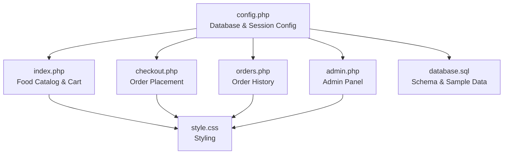
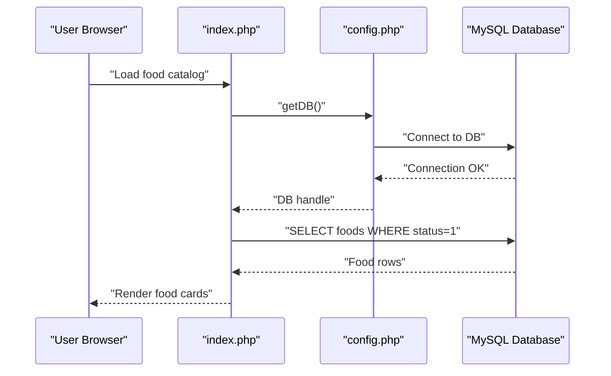

# Troubleshooting and FAQ

<cite>
**Referenced Files in This Document**
- [config.php](file://config.php)
- [index.php](file://index.php)
- [checkout.php](file://checkout.php)
- [orders.php](file://orders.php)
- [admin.php](file://admin.php)
- [database.sql](file://database.sql)
- [style.css](file://style.css)
</cite>

## Table of Contents
1. [Introduction](#introduction)
2. [Project Structure](#project-structure)
3. [Core Components](#core-components)
4. [Architecture Overview](#architecture-overview)
5. [Installation Troubleshooting](#installation-troubleshooting)
6. [Runtime Issues and Solutions](#runtime-issues-and-solutions)
7. [Debugging Strategies](#debugging-strategies)
8. [Performance Optimization](#performance-optimization)
9. [Security and Maintenance](#security-and-maintenance)
10. [FAQ](#faq)
11. [Diagnostic Tools and Techniques](#diagnostic-tools-and-techniques)
12. [Conclusion](#conclusion)

## Introduction
This document provides comprehensive troubleshooting guidance for the Food Delivery System. It covers installation issues (database connectivity, PHP configuration, file permissions), runtime problems (session errors, database connectivity, cart persistence), debugging approaches (PHP errors, SQL issues, JavaScript), performance tuning, security hardening, maintenance procedures, and frequently asked questions. The goal is to help developers and operators quickly diagnose and resolve issues in both development and production environments.

## Project Structure
The system consists of a small PHP application with a MySQL backend and a simple frontend. Key files include configuration, pages for browsing food, checkout, order history, and admin panel, plus the database schema.

**Diagram sources**
- [config.php:1-71](file://config.php#L1-L71)
- [index.php:1-203](file://index.php#L1-L203)
- [checkout.php:1-127](file://checkout.php#L1-L127)
- [orders.php:1-137](file://orders.php#L1-L137)
- [admin.php:1-312](file://admin.php#L1-L312)
- [database.sql:1-54](file://database.sql#L1-L54)
- [style.css:1-610](file://style.css#L1-L610)

**Section sources**
- [config.php:1-71](file://config.php#L1-L71)
- [index.php:1-203](file://index.php#L1-L203)
- [checkout.php:1-127](file://checkout.php#L1-L127)
- [orders.php:1-137](file://orders.php#L1-L137)
- [admin.php:1-312](file://admin.php#L1-L312)
- [database.sql:1-54](file://database.sql#L1-L54)
- [style.css:1-610](file://style.css#L1-L610)

## Core Components
- Database configuration and connection management
- Session initialization and admin authentication
- Food catalog retrieval and filtering
- Cart persistence using browser local storage
- Order creation and order item insertion
- Order search by phone number
- Admin panel for managing orders and food items

**Section sources**
- [config.php:10-20](file://config.php#L10-L20)
- [config.php:67-70](file://config.php#L67-L70)
- [config.php:27-49](file://config.php#L27-L49)
- [index.php:101-200](file://index.php#L101-L200)
- [checkout.php:4-36](file://checkout.php#L4-L36)
- [orders.php:6-25](file://orders.php#L6-L25)
- [admin.php:5-60](file://admin.php#L5-L60)

## Architecture Overview
The system follows a thin PHP MVC-like structure:
- Front controller pattern via individual page files
- Shared configuration module for DB and session
- Stateless client-side cart persistence
- Server-side order persistence in MySQL

**Diagram sources**
- [index.php:4-6](file://index.php#L4-L6)
- [config.php:10-20](file://config.php#L10-L20)
- [config.php:27-40](file://config.php#L27-L40)

## Installation Troubleshooting

### Database Connection Errors
Symptoms:
- Immediate page load failure with a connection error message
- White screen or fatal error during page load

Common causes and fixes:
- Incorrect host, username, password, or database name in configuration
  - Verify constants in the configuration file match your MySQL setup
- MySQL service not running
  - Ensure MySQL is started in your local server stack
- Database does not exist
  - Run the schema script to create the database and tables
- Character set mismatch
  - Ensure the database uses utf8mb4 collation as defined in the schema

Verification steps:
- Confirm database credentials in the configuration file
- Test connection using a MySQL client
- Execute the schema script to initialize tables and sample data

**Section sources**
- [config.php:3-7](file://config.php#L3-L7)
- [config.php:10-20](file://config.php#L10-L20)
- [database.sql:3-40](file://database.sql#L3-L40)

### PHP Configuration Issues
Symptoms:
- Headers already sent errors
- Session-related warnings
- Fatal errors related to missing extensions

Common causes and fixes:
- Output before headers (e.g., whitespace before opening tag)
  - Ensure no output before the opening PHP tag in included files
- Session not started
  - The configuration file starts sessions automatically; ensure it is included before any output
- Missing MySQLi extension
  - Enable mysqli in your PHP configuration

**Section sources**
- [config.php:67-70](file://config.php#L67-L70)
- [config.php:10-20](file://config.php#L10-L20)

### File Permission Problems
Symptoms:
- Cannot write logs or cache (if enabled)
- Web server cannot read configuration files

Common causes and fixes:
- Incorrect ownership or permissions on the application directory
  - Set proper ownership for the web server user
- Local storage access denied in browsers
  - Ensure the site runs under a secure context (HTTPS) for persistent storage

**Section sources**
- [config.php:67-70](file://config.php#L67-L70)

## Runtime Issues and Solutions

### Session-Related Errors
Symptoms:
- Session start warnings
- Admin login not persisting

Root causes and fixes:
- Session already started or headers already sent
  - Ensure the configuration file is included before any output and that no extra output precedes it
- Session storage issues
  - Verify PHP session.save_path is writable by the web server

**Section sources**
- [config.php:67-70](file://config.php#L67-L70)

### Database Connectivity Problems
Symptoms:
- Queries fail with connection errors
- Page timeouts while loading data

Root causes and fixes:
- Temporary connection loss
  - Retry logic can be added around database calls
- Long-running transactions
  - Keep database operations minimal and fast
- Prepared statement errors
  - Validate parameter counts and types when binding

**Section sources**
- [config.php:10-20](file://config.php#L10-L20)
- [checkout.php:22-32](file://checkout.php#L22-L32)
- [orders.php:11-15](file://orders.php#L11-L15)

### Cart Persistence Failures
Symptoms:
- Cart resets after refresh
- Items disappear unexpectedly

Root causes and fixes:
- Local storage disabled or cleared
  - Inform users to enable local storage in their browser
- JSON parsing errors
  - Validate cart data before parsing and saving
- Cross-origin restrictions
  - Serve the site from a single origin to avoid storage isolation issues

**Section sources**
- [index.php:101-179](file://index.php#L101-L179)
- [checkout.php:107-124](file://checkout.php#L107-L124)

### Order Creation Failures
Symptoms:
- Order not saved
- Duplicate entries or inconsistent totals

Root causes and fixes:
- Missing required form fields
  - Validate presence of customer name, phone, and cart data
- Total calculation mismatch
  - Recalculate total server-side before inserting orders
- Transaction rollback
  - Wrap order creation in a transaction to ensure atomicity

**Section sources**
- [checkout.php:4-36](file://checkout.php#L4-L36)
- [checkout.php:22-32](file://checkout.php#L22-L32)

### Admin Panel Access Issues
Symptoms:
- Login fails immediately
- Unauthorized access to admin features

Root causes and fixes:
- Incorrect admin password
  - Verify the hardcoded admin password constant
- Session not established
  - Ensure session_start is executed before checking admin status

**Section sources**
- [config.php:7](file://config.php#L7)
- [admin.php:5-11](file://admin.php#L5-L11)
- [config.php:67-70](file://config.php#L67-L70)

## Debugging Strategies

### PHP Error Debugging
Approach:
- Enable error reporting and logging in PHP
- Use error_log to capture exceptions
- Inspect headers and output before sending HTTP responses

Common checks:
- Verify that no output occurs before headers are sent
- Confirm mysqli connection is established before queries
- Log prepared statement bind errors

**Section sources**
- [config.php:10-20](file://config.php#L10-L20)
- [config.php:62-65](file://config.php#L62-L65)

### SQL Query Debugging
Approach:
- Print or log prepared statements and bound parameters
- Validate foreign key constraints and referential integrity
- Check for duplicate keys and unique constraint violations

Common checks:
- Ensure order_items references valid food and order IDs
- Verify ENUM values match allowed sets
- Confirm decimal precision for prices

**Section sources**
- [database.sql:20-40](file://database.sql#L20-L40)
- [checkout.php:22-32](file://checkout.php#L22-L32)

### JavaScript Functionality Debugging
Approach:
- Use browser developer tools to inspect console and network tabs
- Validate localStorage availability and quota limits
- Trace cart lifecycle events

Common checks:
- Confirm cart is initialized from localStorage
- Verify quantity updates and removals
- Ensure checkout form posts serialized cart data

**Section sources**
- [index.php:101-179](file://index.php#L101-L179)
- [checkout.php:107-124](file://checkout.php#L107-L124)

## Performance Optimization
- Minimize database round trips by batching queries where possible
- Use prepared statements consistently to reduce parsing overhead
- Optimize frontend rendering by avoiding unnecessary DOM manipulations
- Cache static assets and leverage browser caching headers
- Monitor and limit cart size to prevent excessive localStorage usage

[No sources needed since this section provides general guidance]

## Security and Maintenance
- Hardcoded credentials
  - Replace hardcoded admin password with a secure secret managed externally
- Input sanitization
  - Escape HTML output and validate/sanitize all user inputs
- Session security
  - Regenerate session IDs after login and enforce secure cookie flags
- Database security
  - Use least-privilege accounts for the application database user
- Regular maintenance
  - Back up the database regularly
  - Review and prune old orders periodically

**Section sources**
- [config.php:7](file://config.php#L7)
- [index.php:59-66](file://index.php#L59-L66)
- [admin.php:5-11](file://admin.php#L5-L11)

## FAQ
- How do I reset the admin password?
  - Change the admin password constant in the configuration file and restart the application.
- Why does my cart disappear after refresh?
  - Ensure your browser allows local storage and the site runs under a secure context.
- Can I add more food categories?
  - Yes, update the categories function and ensure the database ENUM supports the new values.
- How do I scale this system?
  - Migrate to a proper framework, add caching, and consider horizontal scaling for the web tier.
- What are the upgrade paths?
  - Move to a modern PHP framework, adopt a migration system for the database, and implement CI/CD.

[No sources needed since this section provides general guidance]

## Diagnostic Tools and Techniques
- Database diagnostics
  - Connect via MySQL CLI to verify schema and data integrity
  - Check for foreign key constraint violations and missing indexes
- PHP diagnostics
  - Enable error reporting and review logs
  - Use Xdebug for step-through debugging
- Frontend diagnostics
  - Use browser dev tools to monitor network requests and localStorage
  - Validate JavaScript console for runtime errors

**Section sources**
- [database.sql:3-40](file://database.sql#L3-L40)
- [config.php:10-20](file://config.php#L10-L20)
- [index.php:101-179](file://index.php#L101-L179)

## Conclusion
This troubleshooting guide consolidates common issues and their solutions for the Food Delivery System. By following the installation, runtime, and debugging strategies outlined here, you can maintain a reliable and secure deployment. For long-term sustainability, consider adopting a modern framework, implementing robust error handling, and establishing automated monitoring and backups.